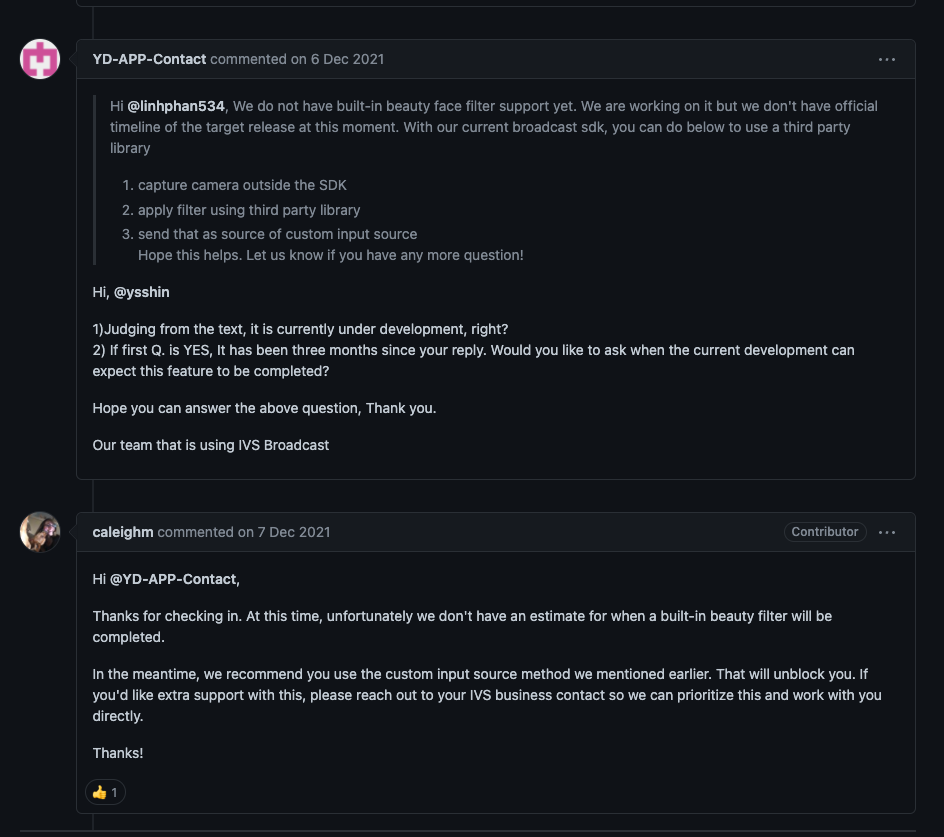

# 美顏 sdk

開播上線後的後續進階功能。美顏的特效，找尋相關可使用的 sdk 規劃以及相關說明。

---
---

## 大綱

- [美顏 sdk](#美顏-sdk)
  - [大綱](#大綱)
  - [說明](#說明)
  - [概述](#概述)
  - [研究的資訊統整](#研究的資訊統整)
  - [下載機制](#下載機制)
    - [下載機制-初步規劃想法](#下載機制-初步規劃想法)
  - [參考](#參考)

---
---

## 說明

開播有個美顏的需求，這邊稍微描述一些資訊。

---
---

## 概述

AWS 官方有在開發美顏功能，但在研究階段時， AWS 只有提到此功能開發中，

尚未有上線計畫。

- 相關 issue 截圖

  

所以需要另外研究其他的美顏 sdk。

---
---

## 研究的資訊統整

主要研究人員為 kelvin ， clay

這邊附上相關的連結。

- [美顏功能評估 - Google 試算表]

  > App 內部的研究文件整理。

- [BoTV_APP_手機開播美肌(研究階段) (#1739) · Issues · ChampionGameTeam / Production / DevOps / test-lib · GitLab]

  > BoTV 產品對應的 issue，與 CG 共用。

初步研究結果，最後客戶選用 [DeepAR Developer] 來進行下一步的規劃。

---
---

## 下載機制

後續選用 [DeepAR Developer] 後，有個需求是美顏濾鏡需要可以下載更新。

> 主要是新的濾鏡，期望在 美顏 sdk 核心不異動下，可以進行美顏濾鏡的下載更新。

目前初步研究 [DeepAR Developer] 是可行的。

於此先進行初步個規劃想法，以供後續實作前的規劃討論。

### 下載機制-初步規劃想法

規劃下載機制的設計，可能有下面幾個面向。

---

**設計原則 :**

- 一致性

  大部分應該可以在 Flutter 層處理，少部分原生 sdk 提供防呆或檢查功能

- 簡單易用

  介面上簡單原則。

- 最小化設計

  必要的功能設計，簡單處理，太複雜的設計暫緩。

- 好擴充

  有必要的擴充彈性保留即可，之後有新的需求在討論是否需要擴充調整。

---

**機制面 :**

> 確切的項目依照你們研究以及需求來思考規劃

- cdn 位置

- local 位置

  > 可能相依於環境的資料夾

- 濾鏡相關資訊，如何顯示到畫面上

  > 本地已有的項目，待下載項目 ...

- 同一個濾鏡的版本更新

   是否有同一個濾鏡，會有版本異動需求，有的話需要規劃如何更新

   e.g. 版本號，h5 等等

- 可能的上傳工具

- 後台可讓營運自行新增濾鏡功能

  預想應該會有的功能，讓營運可自行新增操作。

  不過這樣也有可能會有刪除功能 ?

…

---

**可能的防呆 :**

- 下載失敗

- DeepAR sdk 目前的相容性

  DeepAR 與濾鏡的素材相容性問題。

  有可能 濾鏡 需要更新的版本才支援，或過來目前的濾鏡需要更新的 sdk 才支援。

…

---
---

## 參考

- [anyway to use beauty face filter feature · Issue #1 · aws-samples/amazon-ivs-broadcast-android-sample · GitHub]

- [BoTV_APP_手機開播美肌(研究階段) (#1739) · Issues · ChampionGameTeam / Production / DevOps / test-lib · GitLab]

- [DeepAR Developer]

---
---

<!-- 連結設定 -->

[anyway to use beauty face filter feature · Issue #1 · aws-samples/amazon-ivs-broadcast-android-sample · GitHub]:
  https://github.com/aws-samples/amazon-ivs-broadcast-android-sample/issues/1

[美顏功能評估 - Google 試算表]:
  https://docs.google.com/spreadsheets/d/1i9JOw1D6Vcgw4zVJdIWIbRbtNUVLc8aI9YLVIoqJeZM/edit?pli=1#gid=0

[BoTV_APP_手機開播美肌(研究階段) (#1739) · Issues · ChampionGameTeam / Production / DevOps / test-lib · GitLab]:
  https://gitlab.com/championgameteam/production/devops/test-lib/-/issues/1739

[DeepAR Developer]:
  https://developer.deepar.ai/

[=> Top](#美顏-sdk)

[=> Go Back](../README.md)
