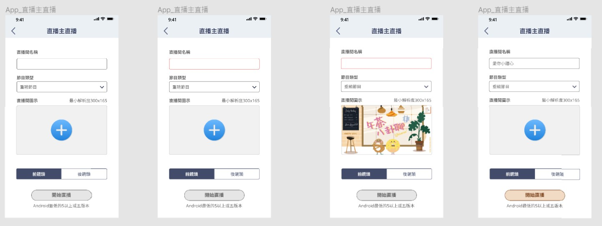
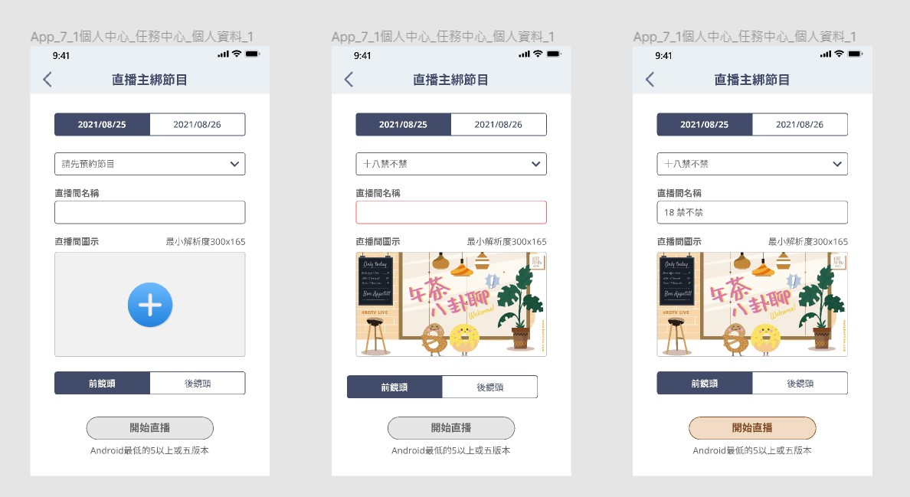
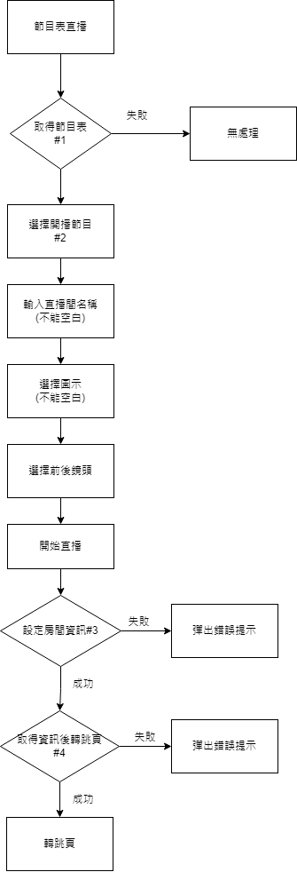
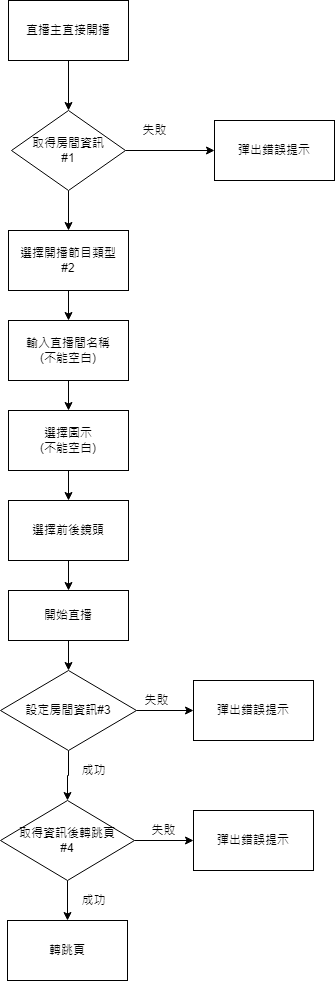

# BoTV直播開播前選擇頁面

## 目錄
[1. 功能說明](#功能說明)  
[2. 參考圖片](#參考圖片)  
[3. 使用套件](#使用套件)  
[4. 使用API](#使用API)  
[5. 流程說明](#流程說明)  


## 功能說明
* page-broadcast-entry-of-direct
1. 輸入直播間名稱
2. 選擇直播類型
3. 上傳直播間圖示
4. 選擇前後鏡頭開播
5. 需要以上資料齊全才能開始直播

* page-broadcast-entry-of-schedule
1. 選擇開播日期
2. 選擇開播的節目表
3. 輸入開播房間名稱
4. 上傳直播間圖示
5. 選擇前後鏡頭開播
6. 需要以上資料齊全才能開始直播

## 參考圖片
* page-broadcast-entry-of-direct

* page-broadcast-entry-of-schedule


## 使用套件

```
cached_network_image
firebase_remote_config
flutter_screenutil
fish_redux
ivs_broadcast
permission_handler
```
## 使用API
* page-broadcast-entry-of-direct

> #1  取得房間資訊
> action/getRaceRoomInfo

> #2  取得節目表類型
> action/categoryList

> #3 設定房間資訊
> upload/setRaceRoomInfo

> #4 取得房間資訊
> action/getLiveStreamInfo

* page-broadcast-entry-of-schedule
> #1  取得節目表
> action/raceSchedule

> #2  取得節目表房間資訊
> action/getRaceRoomInfo

> #3 設定房間資訊
> upload/setRaceRoomInfo

> #4 取得房間資訊
> action/getLiveStreamInfo


## 流程說明

1. 直播主綁節目



2. 直播主直接開播

