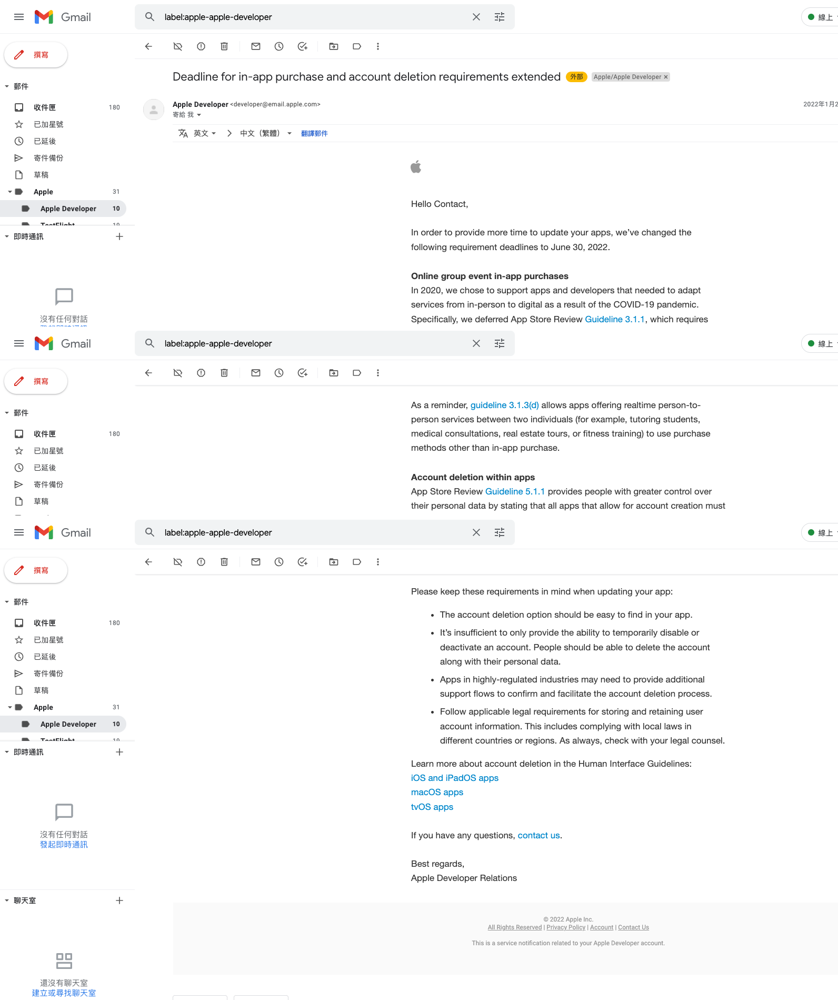
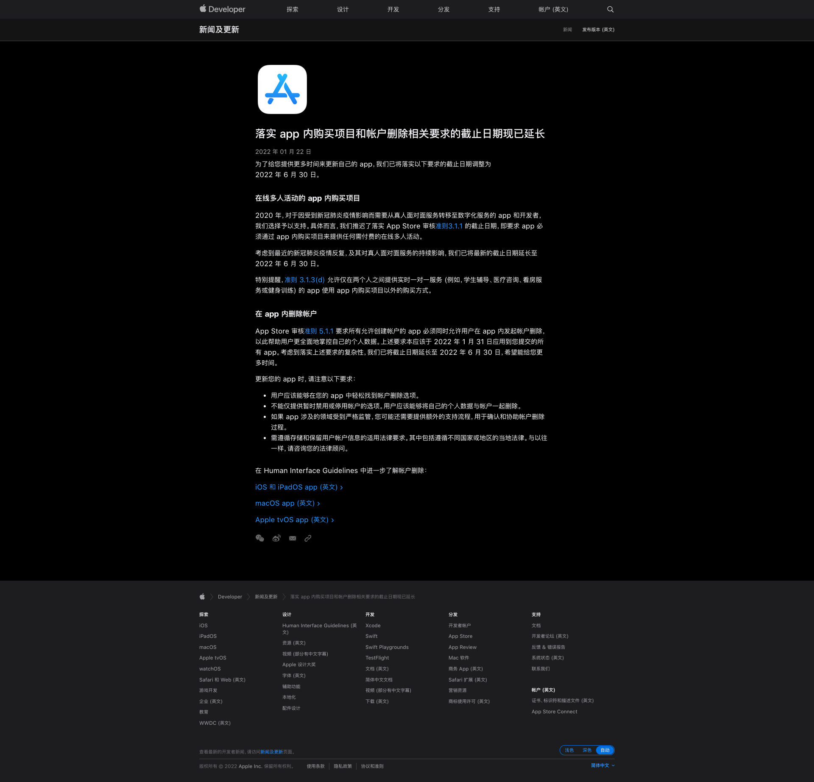
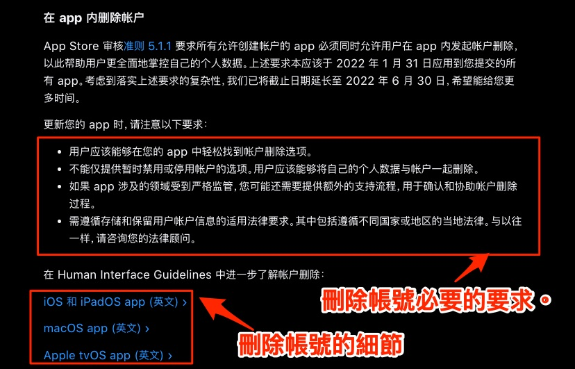

# Deadline for in-app purchase and account deletion requirements extended From Apple Developer Mail

---
---

## 大綱

- [Deadline for in-app purchase and account deletion requirements extended From Apple Developer Mail](#deadline-for-in-app-purchase-and-account-deletion-requirements-extended-from-apple-developer-mail)
  - [大綱](#大綱)
  - [說明](#說明)
  - [Apple Developer Mail 內容](#apple-developer-mail-內容)
  - [分析](#分析)
    - [Online group event in-app purchases](#online-group-event-in-app-purchases)
    - [Account deletion within apps](#account-deletion-within-apps)
  - [參考](#參考)

---
---

## 說明

2021-01-26 整理 email 時，有看到 Apple Developer 的來信，

看來是一些標準的訊息，廣發給開發者。

但有可能內容是需要做對應調整。

在此稍微了解，分析之。

---
---

## Apple Developer Mail 內容

- Mail 截圖

  

- [原文][Apple Developer Original Mail]

- 新聞稿

  後續有找到相關的新聞稿
  
  - 2022-01-22 (簡中)

  

---
---

## 分析

在此次的 mail 訊息。

主要有兩段內容的延期通知。

### Online group event in-app purchases

> 在线多人活动的 app 内购买项目

由於 Covid-19 ，延遲在線多人活動的內購買項目有估的 [審核指南 3.1.1][App Store 审核指南 - Apple Developer - 3.1.1] 的截止日期。

這個 BoTV 產品沒什麼關聯性，應該可以不用關注。

---

### Account deletion within apps

> 在 app 内删除帐户

App Store [審核指南 5.1.1][App Store 审核指南 - Apple Developer - 5.1.1] 要求所有允許創建帳戶的 app 必須同時允許用戶在 app 內發起帳戶刪除，

以此幫助用戶更全面地掌控自己的個人數據。

目前截止日期延長到 `2022-06-30`。

```diff
- 此項目比較有可能需要調整，需要後續關注。
- Dateline : 2022-06-30。
```



**延伸議題 :**

- 最嚴謹的做法是照 Apple 提供的 Human Interface Guideline

  照他的原則規範，了解並執行。

- [Apple says apps must offer a way to delete your account starting in early 2022 | Engadget]

  這篇文章 (2021-10-06)， 有講到 Apple 只要求開發人員讓人們 "從應用程序中開始刪除他們的帳號"，

  因此，App 可能在使用者真正關閉該帳號前，發送到另一個網站，或者是客服接續聊天以及處理後續。

  - PS : 此篇是去年底的文章，不確定是否 Apple 在那之後有更明確的規範出來。

    但此作法可能是相對簡單的做法，但後端系統仍然需要提供處理刪除帳號的機制。

    只是不見得是系統的供自動化功能，可以客製化處理。

---
---

## 參考

- [落实 app 内购买项目和帐户删除相关要求的截止日期现已延长 - 新闻 - Apple Developer]

- [App Store 审核指南 - Apple Developer - 3.1.1]

- [App Store 审核指南 - Apple Developer - 5.1.1]

- [Accounts - User Interaction - iOS - Human Interface Guidelines - Apple Developer]

  > for iOS and iPadOS apps

- [Accounts - User Interaction - macOS - Human Interface Guidelines - Apple Developer]

  > for macOS apps

- [Accounts - App Architecture - tvOS - Human Interface Guidelines - Apple Developer]

  > for tvOS apps

- [Apple says apps must offer a way to delete your account starting in early 2022 | Engadget]

---
---

<!-- 連結設定 -->
[Apple Developer Original Mail]:
  ./OriginalMail/README.md

[落实 app 内购买项目和帐户删除相关要求的截止日期现已延长 - 新闻 - Apple Developer]:
  https://developer.apple.com/cn/news/?id=i71db0mv

[App Store 审核指南 - Apple Developer - 3.1.1]:
  https://developer.apple.com/cn/app-store/review/guidelines/#3.1.1

[App Store 审核指南 - Apple Developer - 5.1.1]:
  https://developer.apple.com/cn/app-store/review/guidelines/#5.1.1

[Accounts - User Interaction - iOS - Human Interface Guidelines - Apple Developer]:
  https://developer.apple.com/design/human-interface-guidelines/ios/user-interaction/accounts/

[Accounts - User Interaction - macOS - Human Interface Guidelines - Apple Developer]:
  https://developer.apple.com/design/human-interface-guidelines/macos/user-interaction/accounts/

[Accounts - App Architecture - tvOS - Human Interface Guidelines - Apple Developer]:
  https://developer.apple.com/design/human-interface-guidelines/tvos/app-architecture/accounts/

[Apple says apps must offer a way to delete your account starting in early 2022 | Engadget]:
  https://www.engadget.com/apple-app-store-ios-developers-delete-account-report-193119525.html

[=> Top](#deadline-for-in-app-purchase-and-account-deletion-requirements-extended-from-apple-developer-mail)

[=> Go Back](../README.md)
