# DynamicLink To Store Link

  Firebase 的 Dynamic Link，有直接支援 iOS/Android 的商城連結，說明需求以及設定方式。

---
---

## 大綱

- [DynamicLink To Store Link](#dynamiclink-to-store-link)
  - [大綱](#大綱)
  - [緣由](#緣由)
  - [商城連結](#商城連結)
  - [Firebase 專案設定](#firebase-專案設定)
  - [實際設定後結果](#實際設定後結果)
  - [附註](#附註)

---

## 緣由

在 2021-06-25 BoTV 的需求會議中， Irene 提出來客戶要打廣告，

可否提前給商城連結，雖然商城連結已經知道網址，

但尚未正式發佈，所以會是空的，無法做實際確認。

中間有提到 web 網頁有一個 QRCode，

可以在同一個 QRCode 狀況下，

之後在 Firebase 專案中設定好相關應用程式有關項目，

> 印象中是 Dyanamic Link，可在做確認

透過 Firebase 的 Dynamic Link 機制，

可以自動導引到商城。

---

## 商城連結

- Android : 規則

  > `https://play.google.com/store/apps/details?id=[applicationID]`

  e.g.

  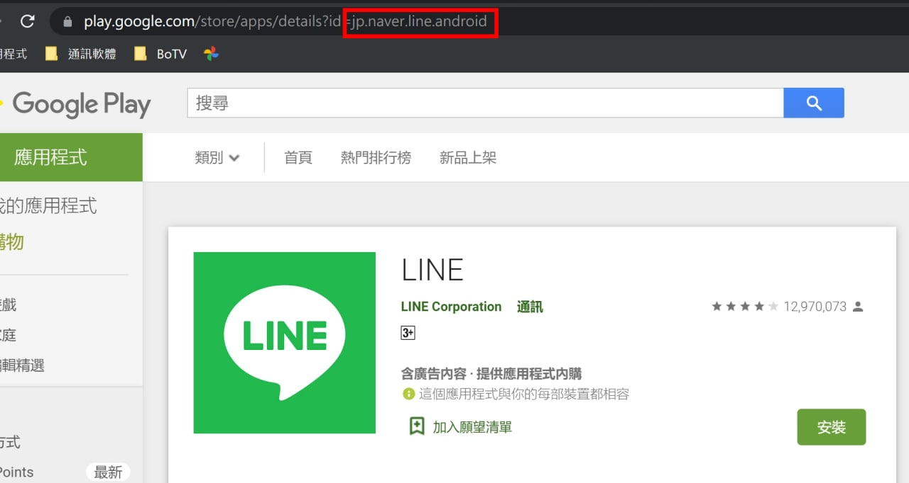

- iOS : 規則

  > `https://apps.apple.com/us/app/botv/id[Apple ID]`

  e.g.

  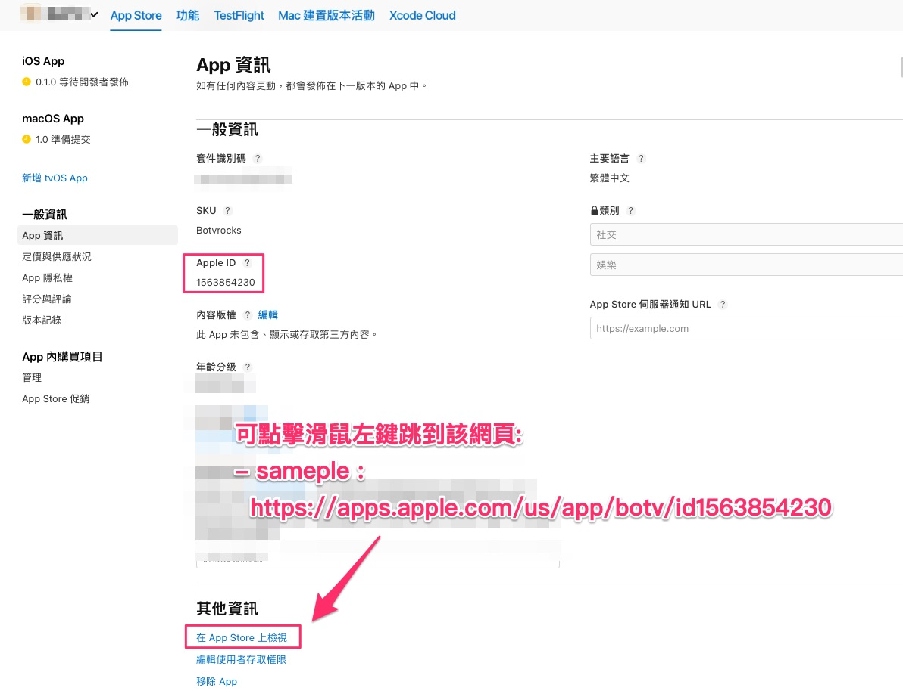

---
---

## Firebase 專案設定

**初步探索 :**

> 印象中是 Dyanamic Link，可在做確認，以下以 Dynamic Link 的專案中應用程式有關 ynamic Link設定為出發點。

- Android

  有關 Dynamic Link 的使用，需要設定 sha256

  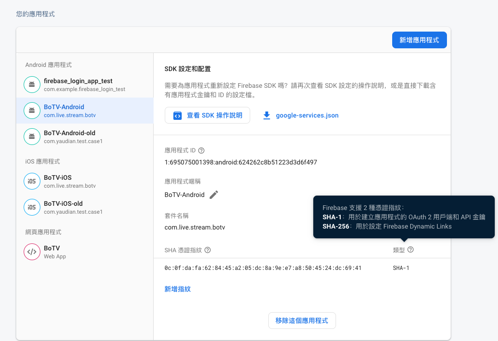

- iOS

  iOS 需提供 App Store ID，Team ID

  > App Store ID 可於 App Store Connect 網站上找到，
  >
  > App Store Connect 上面稱為 Apple ID
  >
  > Team ID 資訊則需到 Apple Developer 網站中找尋。

  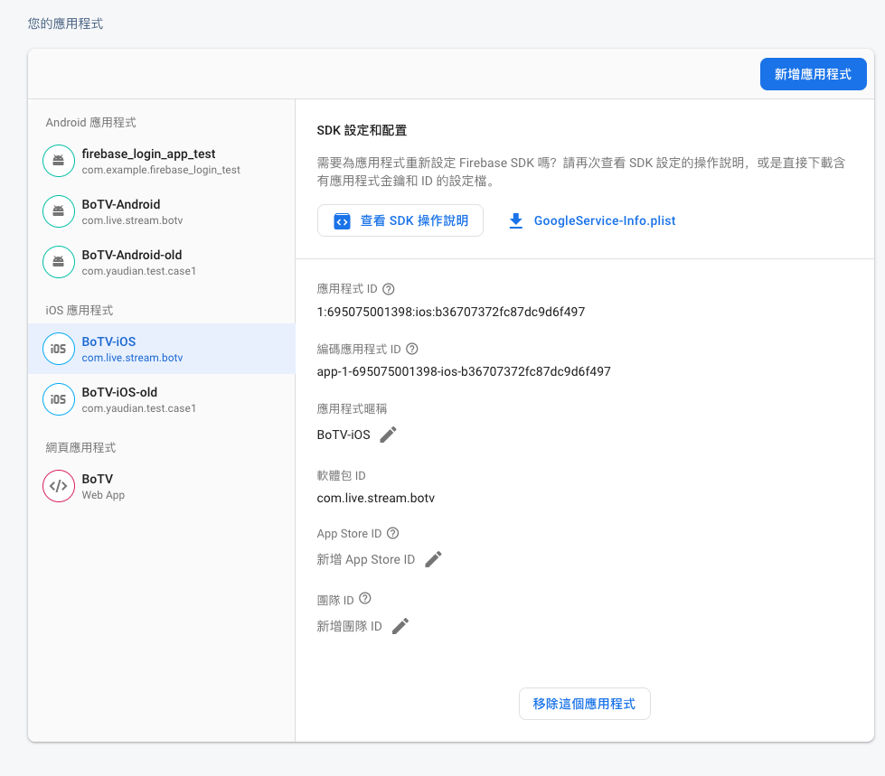

  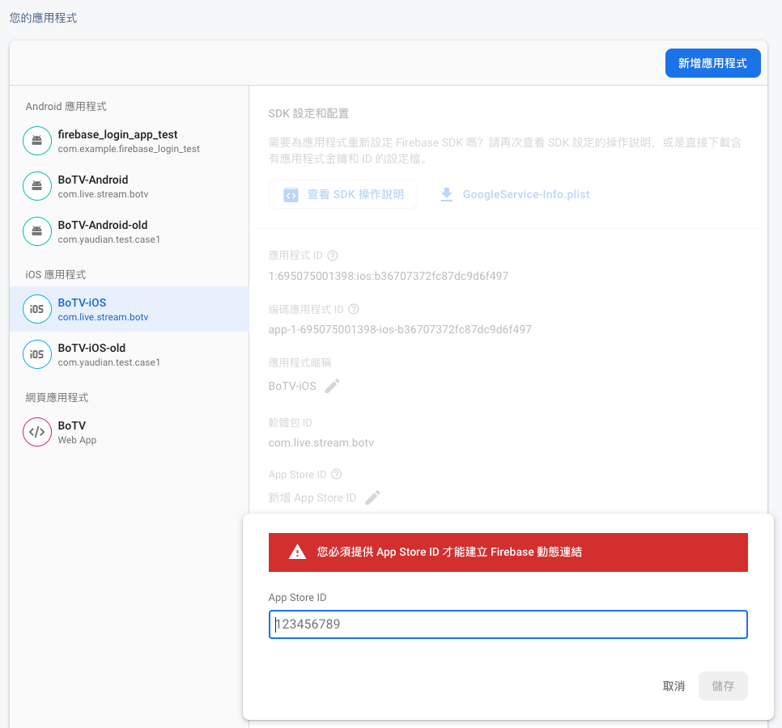

  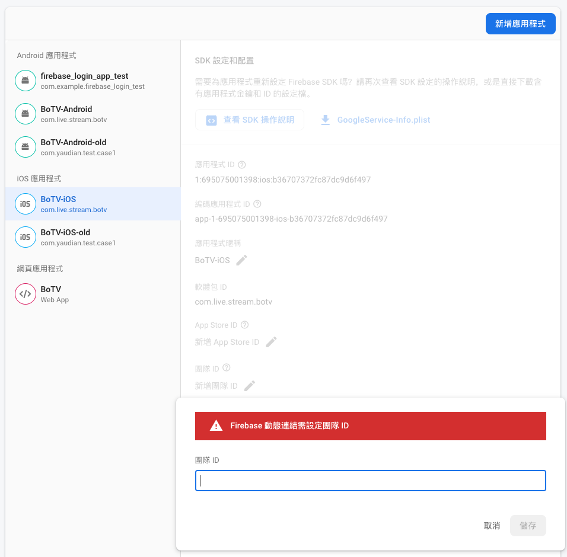

---
---

## 實際設定後結果

經由 kelvin 協助，已經完成 Firebase 的相關設定。

這邊列出調整後的設定內容，以及 Firebase Dynamic Link 設定內容。

**Firebase 專案設定 :**

- Android :

  有設定好 sha 256。

  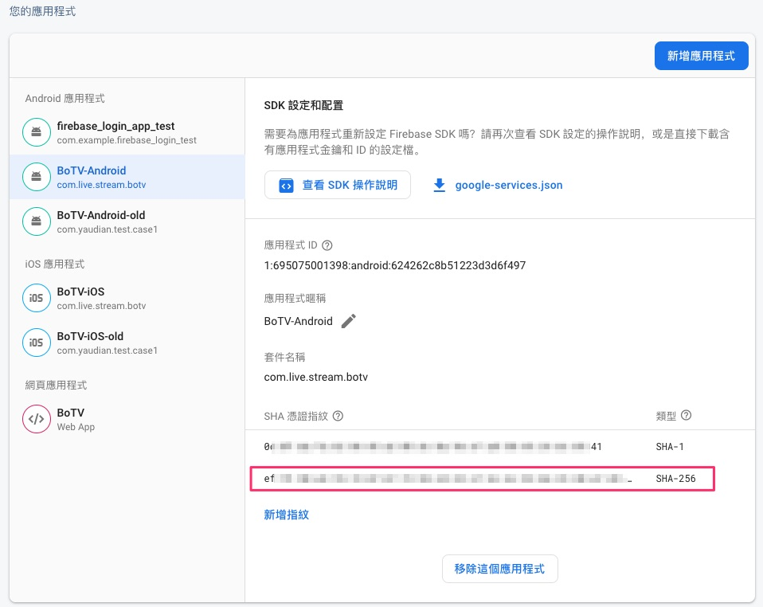

- iOS :

  有設定好 App Store ID 以及 Team ID。

  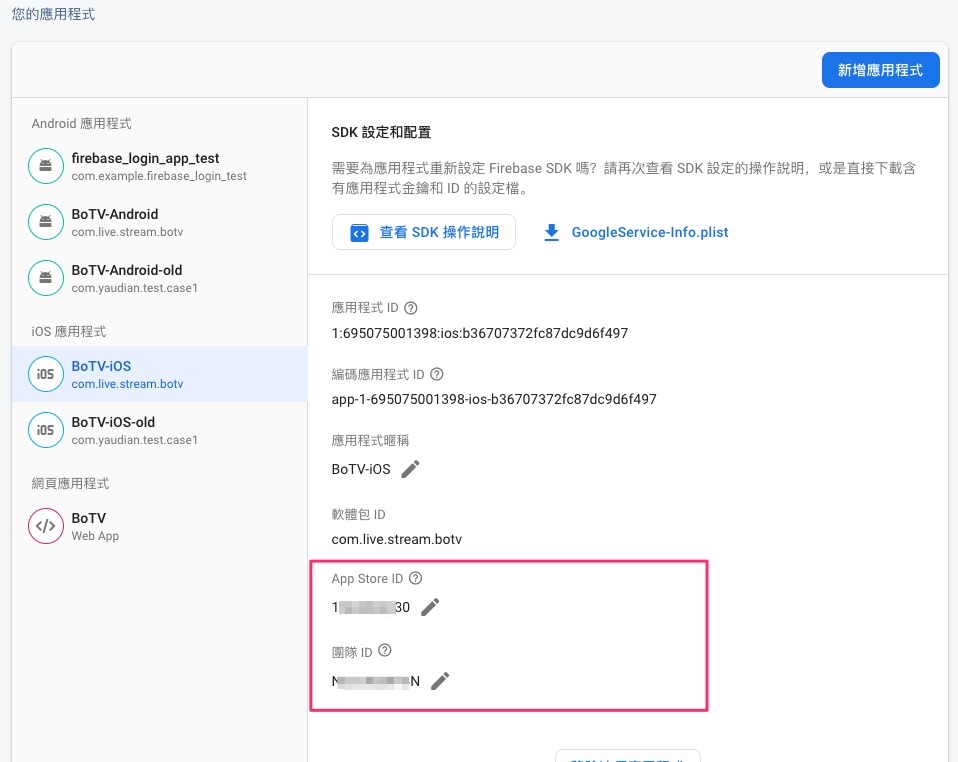

**Firebase Dynamic Link :**

- 01 : 點擊 Dynamic Link 功能

  > 已經有設定好的 Dynamic Link

  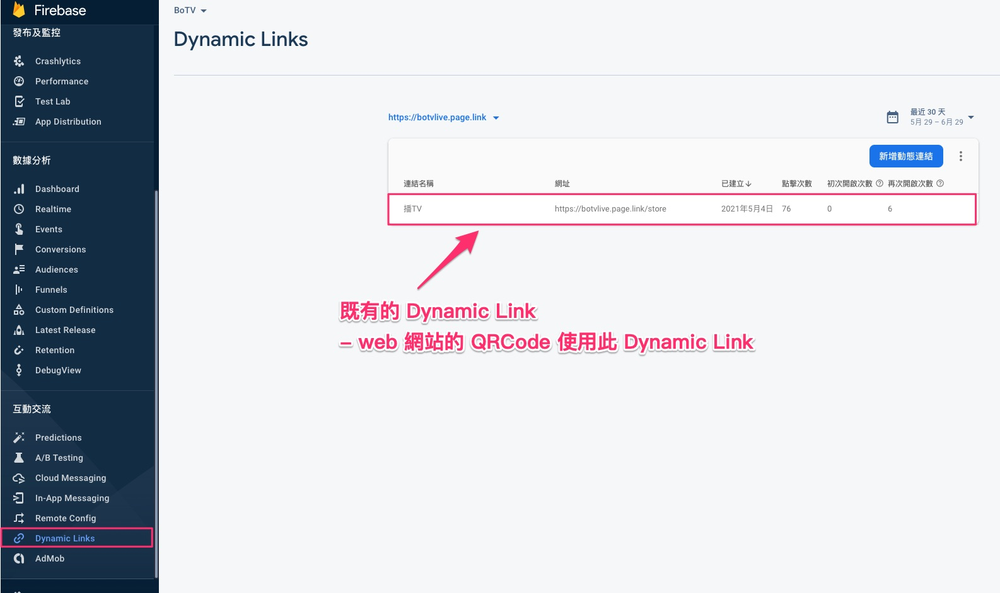

- 02 : 點擊 滑鼠左鍵

  > 會顯示該 Dynamic Link 的下拉式選單。

  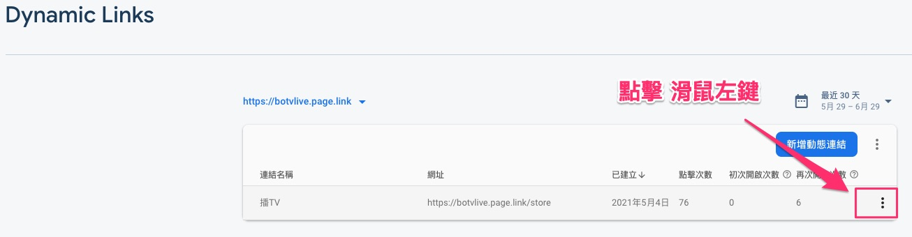

- 03 : 點擊 編輯

  > 可看該 Dynamic Link 的設定細節

  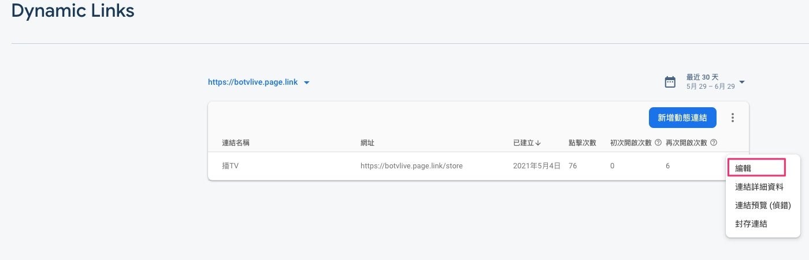

- 04 : iOS

  > 原本這邊是未完成，確認有設定成功，也有非商城的使用方式。

  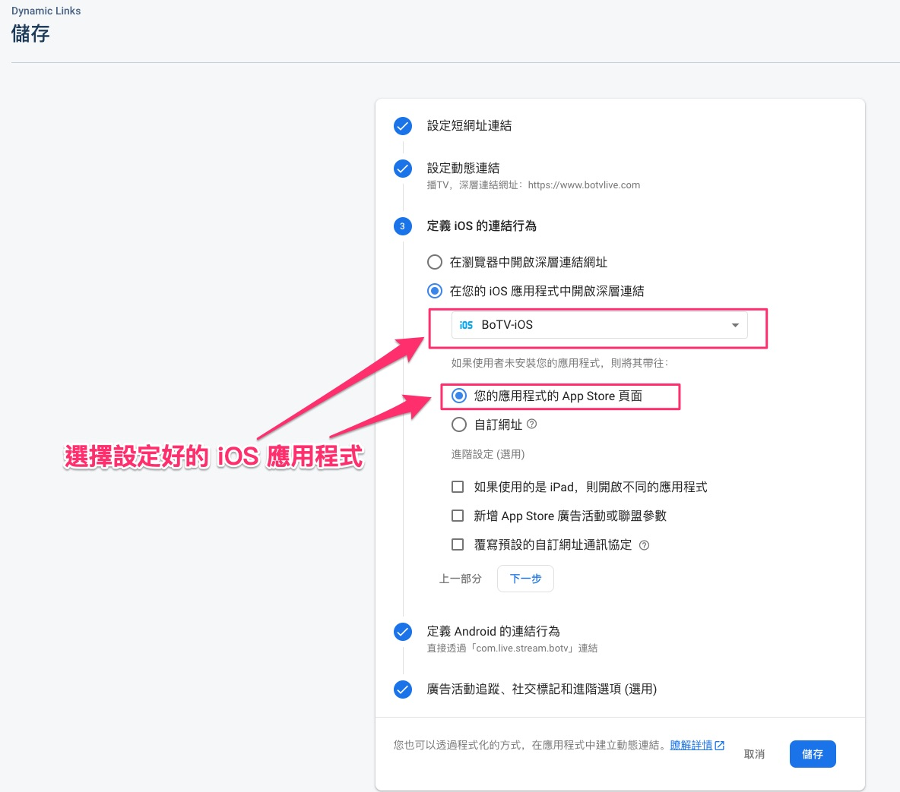

- 05 : Android

  > 原本這邊是未完成，確認有設定成功，也有非商城的使用方式。

  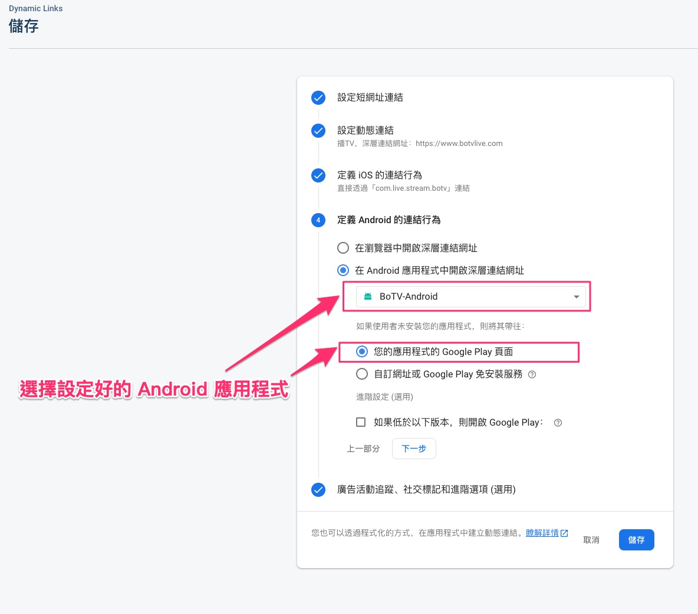

---
---

## 附註

由於是直接綁定上架的一些資訊

有可能不同專案的 firebase 只能設定一個

e.g. official 設定了， experiment 可能會有問題

這個需要確認

---
---

[=> Top](#dynamiclink-to-store-link)

[=> Go Back](../README.md)
