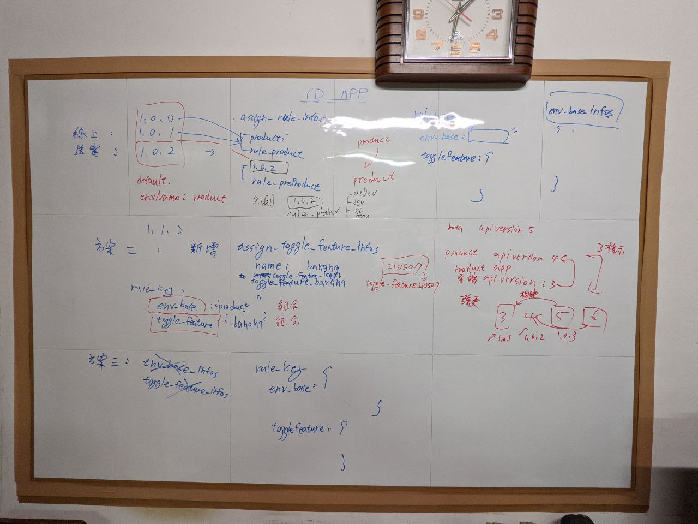
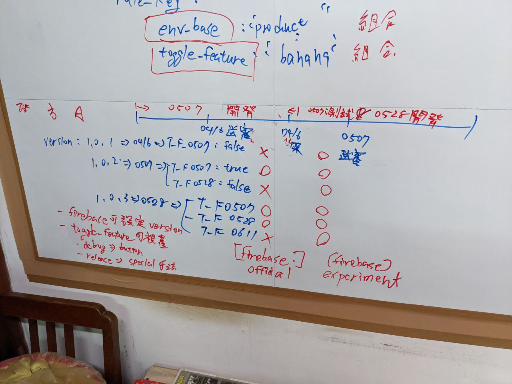

# 2nd_2021-05-07

原先預計 2021-05-07 需要有新的功能規劃，

後來調整為 2021-05-28 完成，

可將 2021-05-07 定義為至少完成功能規劃。

決定後的方案可定義為第二版 remote config 功能。

- 2021-07-09 :

  新增 [採用方案四的簡化作法](#採用方案四的簡化作法) 說明。

---
---

## 大綱

- [2nd_2021-05-07](#2nd_2021-05-07)
  - [大綱](#大綱)
  - [必要功能](#必要功能)
  - [可選功能](#可選功能)
  - [規劃可能方案](#規劃可能方案)
  - [結論](#結論)
  - [採用方案四的簡化作法](#採用方案四的簡化作法)
    - [當日會議手札](#當日會議手札)

---
---

## 必要功能

- 指定環境 :

  通常應用點，某個 iOS 送審版本，

  但此功能為系統有新舊功能衝突，

  此時無法使用 後端提供的 Api 向下相容來處理，

  > 可能此功能上線，會導致舊的客端有問題。

  需要於送審時，切到指定環境。

  - 限制

    Firebase，FB 等設定需跟著 flavor 環境跑，

    > Firebase project 與 Facebook App 設定，
    >
    > 目前依照 flavor 來編譯包版，不可變動。

    已經編好的 app， 只能切換相同的 flavor 搭配的環境。

    例如： 同樣為 experiment 的環境，才能做切換。

  - 建議 :

    由於送審的 flavor : official，

    建議是從線上環境 product，複製一個新的環境，

    假設叫做 `preProduct`，

    後端再將要升版的內容新功能，

    推到 `preProduct`，

    指定特殊版本(送審的版本)，

    強制切換到 `preProduct`。

---
---

## 可選功能

- toggle feature :

  可選開關功能，依照不同的版本 (環境) 可指定功能性開關，

  作為客端功能性開關的切換，

  - 好處

    可同時開發新版本以及送測版本的相容。

    > 若設定細一點，可做為之後的滾動性新增需求的概念，
    >
    > 方便快速迭代。

  - 隱憂

    後續的維護須考量，需不定期移除已經是常態的開關，

    比如 : always on，或 always off。

- review version :

  突然想到的，若有送審時需遮蔽功能，

  或許可藉由判斷當下版本是否為送審版本，

  來做一些遮蔽的作用。

  > 比如 : [xxx] 功能即將開放，等未完全的功能是不能看到的。

  另一個想法，若以 toggle feature 來思考某功能的話，

  比方 : `isShowComingSoon` 或者 `is_review` 來當作 toggle feature，

  或許就不需要獨立此功能，但這樣需要的是思考是，
  
  環境與 toggle feature 不能做強綁定，

  可能需要作組合式的概念。

---
---

## 規劃可能方案

以下方案都是以符合需求想法來說明，

若不變的部分先不說明。

**Assign Rule 概念:**

- [指定環境功能的通用性概念]

  > 通用性為 assign rule 作法。

**方案說明 :**

> by rule 彈性 區分不同的方案

- [方案一](./Scheme1/README.md)

- [方案二](./Scheme2/README.md)

- [方案三](./Scheme3/README.md)

- [方案四](./Scheme4/README.md)

**Toggle Feature 設計概念:**

- [Toggle Feature 概念](./ToggleFeatureConcept/README.md)

  > Toggle Feature 概念以及設計原則。

**Remote Config Visualization :**

- [Remote Config 可視化](./RemoteConfigVisualization/README.md)

  > Firebase Remote Config，App 使用資訊的可視化功能說明。

---

## 結論

上次的討論，以`方案二`或`方案四`其一來實作。

二與四都有達到 env_base 以及 toggle_feature 的彈性設計。

比較表可看 [rule 彈性](./AssignRuleConcept/README.md#rule-彈性)

---

## 採用方案四的簡化作法

最後實作採用 `方案四`，

於 2021-07-09 講解概念及同步時，

由於是 `方案四` 的最大彈性，

導致 [指定環境功能的通用性概念] 有近一步簡化，

這邊特別提出，`方案四` 之後的調整作法，

描述於此 [方案四-指定環境功能的概念]

---

### 當日會議手札

- 方案案例說明

  

- Toggle Feature 討論

  

---
---

<!-- 連結設定 -->
[指定環境功能的通用性概念]: ./AssignRuleConcept/README.md

[方案四-指定環境功能的概念]: ./Scheme4_AssignRuleConcept/README.md

[=> Top](#2021-05-07)

[=> Go Back](../README.md)
