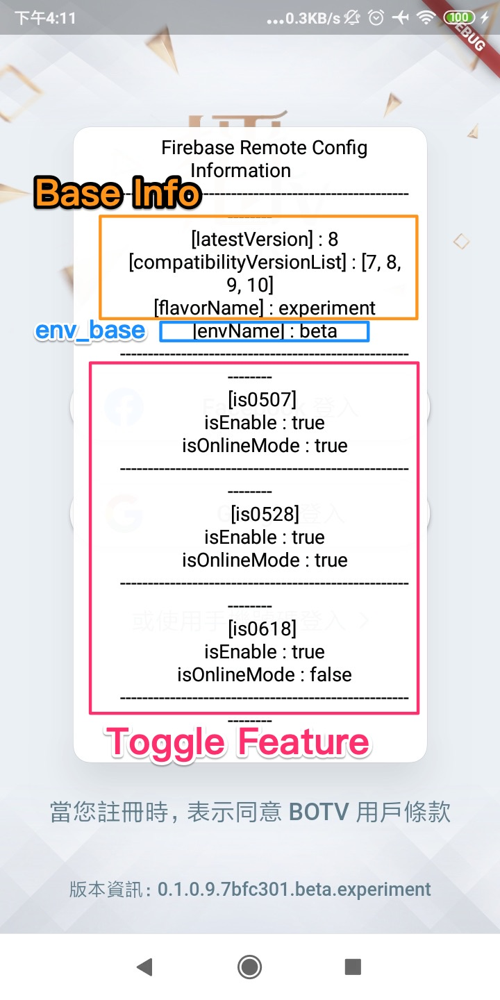

# Remote Config Visualization

Firebase Remote Config，App 使用資訊的可視化功能說明。

---

## 大綱

- [Remote Config Visualization](#remote-config-visualization)
  - [大綱](#大綱)
  - [可視化概念](#可視化概念)
  - [可視化功能規劃](#可視化功能規劃)
  - [附註](#附註)
    - [可視化-初版](#可視化-初版)
    - [可視化-2nd](#可視化-2nd)

---

## 可視化概念

可視化主要可針對取得 Remote Config 資訊的內容做可視化處理。

由於 Remot Config 上面是所有的設定資訊，

而當下的 App 執行時，會取部分對應內容來處理，

且 Toggle Feature 設計/套用規則有其複雜，

> 每個 Toggle Feature 都有其可以 assign from Firebase Remote Config 的設計。

所以為了方便可以除錯，有些資訊是需要透漏出來。

最好可以在畫面上直接顯示，此即為可視化的概念。

**RemoConfig Info :**

- 基本資訊

  一定會取得的資訊，依照實際情況可能會新增刪減。

  範例如下 :

  - flavor

  - lastest version

  - compability version

  - etc...

**Rule Info :**

- env_base

  對應到的環境的基本設定。

- toggle_feature

  目前對應的功能開關設定。

  > 若將每個 Toggle Feature 的 mode 呈現出來也不錯。

**附註 :**

上述資訊目前為參考概念，

可先引用基本需要了解的，

實務上覺得有不足再來添加。

---

## 可視化功能規劃

所以為了方便自測或遇到問題的檢查，需考量如何在 App 的畫面中，

直接可視覺化這些設定的內容。

可視化功能如下規劃。

- debug 組態 :
  
  有個按鈕可以點擊觸發，由於是 Debug，

  所以該按鈕可以不用太講究。

  > 可能在特定頁面會有某個隱藏 (或是半透明) 按鈕，
  >
  > 可能用登入頁面比較合適。

- profile/release 組態 :

  需使用特殊手法才能叫出 Toggle Feature 可視化內容。

- 附註 :

  profile 還不確定與 debug 還是 release 同一個區塊比較好。

---

## 附註

目前經由 kelvin 實作，

時間因素，暫時簡單處理。

### 可視化-初版

- 初版 :

  debug/profile 可點擊`登入頁`下方的`版本資訊`。

  > Kelvin Cheng, [May 28, 2021 at 12:40:18 AM (May 28, 2021 at 12:42:58 AM)]:
  >
  > 可視化 要看 remote config  info 要點選 登入頁下方 版本號那邊
  >
  > 只有 debug 和 profile 會顯示喔

- 時間 : 2021-05-28 (中午)

**範例 :**

- 可視化隱藏按鈕

  點擊版本資訊

  

- Firebase Remote Config Info

  

---

### 可視化-2nd

後續調整。

- 時間 : 2021-05-28 (晚上)

  調整為 release 也可叫出，使用工程模式概念。

  > Kelvin Cheng, [May 28, 2021 at 8:10:31 PM]:
  >
  > 工程模式做好囉，說明一下怎麼用
  >
  > 十秒內連點十下，可開啟工程模式，五秒後自動關閉，長按可開啟 remote config info
  >
  > 這是在 release 時的手勢條件
  >
  > 其他 debug profile 模式只要長按就可以開 remote config info 了

- debug/profile

  調整為長按

- release

  新增打開功能模式。

  - 三秒內連點十下，開啟工程模式

    > 十秒後自動關閉

  - 開啟工程模式下 :

    長按可開啟 remote config info

---

[=> Top](#remote-config-visualization)

[=> Go Back](../README.md)
