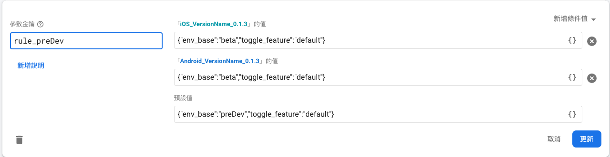

# Scheme 4 Assign Rule Concept

採用 `方案四` 之後的簡化作法，其概念說明。

---
---

## 大綱

- [Scheme 4 Assign Rule Concept](#scheme-4-assign-rule-concept)
  - [大綱](#大綱)
  - [說明](#說明)
  - [概念](#概念)
  - [範例](#範例)
    - [範例 A](#範例-a)
    - [範例 B](#範例-b)
  - [結論](#結論)
  - [參考](#參考)

---
---

## 說明

- 文件撰寫日期 : 2021-07-09

單獨說明，採用方案四之後的簡化作法對應概念。

> 可先快速看過 [指定環境功能的通用性概念]，
>
> 再來看簡化概念作法，會比較容易了解。

---
---

## 概念

- assign_rule_infos :

  裡面的資訊會去匹配名稱對應的規則。

- rule_xxx :

  某個規則。

- 流程 :

  App 抓到 remote config 資訊時，

  `驗證資料合法性` 後，

  > 驗證資料牽涉到細節，須參考各自方案的 `驗證資料合法性` 的做法。

  由於採用 `方案四`，以最大的彈性來設計，

  再加上 Remote Config 的條件設定，

  已經可以滿足 `指定環境` 的需求，

  所以最後程式碼這部分有簡化實作。

  - 目前程式碼只保留預設環境匹配做法 :

    以此編譯時的 `envName` 當作預設環境。

    找其預設環境對應的 `rule` 套用。

  > 於今日同步時，發現指定環境改使用條件方式，
  >
  > 於 rule_xxx 作版本條件的調整。

  - 實際測試的範例:

    **情境 :**

    - 版本 : 0.1.3

    - 編譯時期的 envName : preDev

    - 指定環境 : beta

    - firebase : experiment

    - remote config 設定 :

      

      - rule_preDev 為 preDev 的對應 rule_key

      - iOS_VersionName_0.1.3 :

        篩選條件為 iOS 的 BundleShortVersion : 0.1.3

        內容 :

        ```json
        {"env_base":"beta","toggle_feature":"default"}
        ```

        `env_base` 指定為 `beta`。

      - Android_VersionName_0.1.3 :

        篩選條件為 Android 的 Version Name : 0.1.3

        內容 :

        ```json
        {"env_base":"beta","toggle_feature":"default"}
        ```

        `env_base` 指定為 `beta`。

      - default :

        不在刪選條件的走預設值。

        ```json
        {"env_base":"preDev","toggle_feature":"default"}
        ```

---
---

## 範例

某次的 [iOS] 線上送審，遇到 `後端` 無法作向下相容，

此時需要做送審環境的指定環境功能。

**範例的通用條件:**

- 出版時編譯環境

  envName : product

  > 此為 default envName，編譯時期決定。

- compatibility_versions

  相容清單 :

  ```js
  [1.0.0,1.0.1,1.0.2]
  ```

- 送審版本 : 1.0.2

- assign_rule_infos

  指定規則資訊

  ```json
  [
    {
      "name": "product",
      "rule_key": "rule_product"
    }
  ]
  ```

- rule_product

  product 的 rule。

  - iOS_VersionName_1.0.1 (對應 BundleShortVersion : 1.0.1)

    ```json
    {
      "env_base": "reviewProduct",
      "toggle_feature": "product"
    }
    ```

  - default (預設值) :

    ```json
    {
      "env_base": "product",
      "toggle_feature": "product"
    }
    ```

- assign_env_base_infos

  ```json
  [
    {
      "name": "product",
      "env_base_info_key": "env_base_info_product"
    },
    {
      "name": "reviewProduct",
      "env_base_info_key": "env_base_info_reviewProduct"
    },
  ]
  ```

---

### 範例 A

此版本為架上的版本。

- info.plist

  CFShortVersion : "1.0.0"

  > iOS 的 release 版本，相容性清單的比對基準。

**說明 :**

CFShortVersion 有在 compatibility_versions 中，

且在 rule_product 並無匹配到的篩選條件，

會走其對應的 `預設值`，

> "env_base": "product"

也就是需要再去看 `env_base_info_product` 的環境的細部設定為何。

---

### 範例 B

此版本為送審版本。

- info.plist

  CFShortVersion : "1.0.1"

  > iOS 的 release 版本，相容性清單的比對基準。

**說明 :**

CFShortVersion 有在 compatibility_versions 中，

且在 rule_product 有找到匹配的條件 `iOS_VersionName_1.0.1`，

會走其對應的 `iOS_VersionName_1.0.1` 內容，

> "env_base": "reviewProduct",

也就是需要再去看 `env_base_info_reviewProduct` 的環境的細部設定為何。

---
---

## 結論

指定環境改由 rule_[xxx] 的條件設定來達成，

可以更細膩的指定什麼的編譯版本，

走什麼的條件。

> e.g.
>
> rule_product : 線上環境，
>
> 條件設定為某個 版本對應不同的 env_base，
>
> 即可達到指定環境的需求。

所以原先的 assgin_rule 程式碼要先檢查有沒有版本的淺規則，

這一條就拿掉了，全部以編譯當下的預設環境 (envName) 為主，

只透過 Remote Config 的 `條件` 功能，即可達成需求目的。

---
---

## 參考

- [指定環境功能的通用性概念]

- [方案四]

<!-- 連結設定 -->
[指定環境功能的通用性概念]: ../AssignRuleConcept/README.md
[方案四]: ../Scheme4/README.md

---
---

[=> Top](#assign-rule-concept)

[=> Go Back](../README.md)
