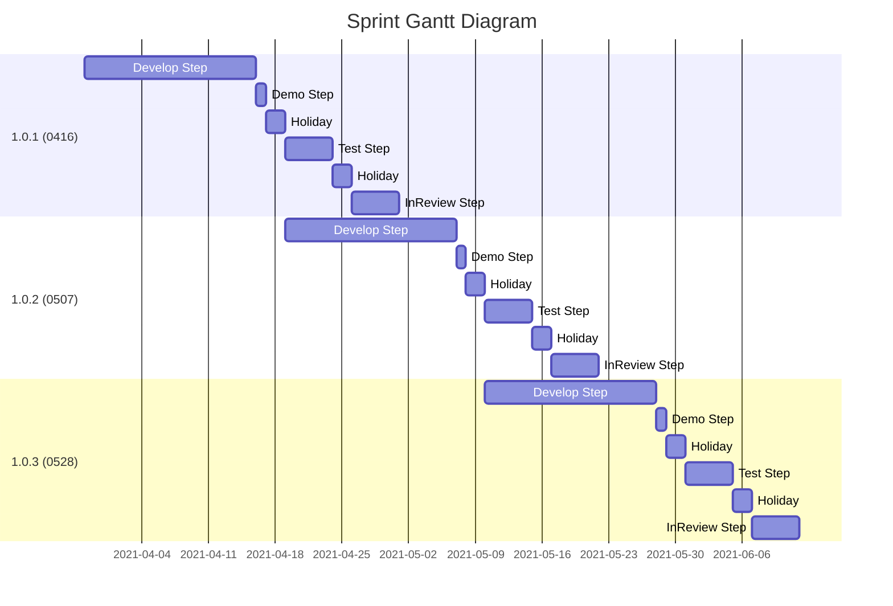

# Toggle Feature Concept

---
---

## 大綱

- [Toggle Feature Concept](#toggle-feature-concept)
  - [大綱](#大綱)
  - [說明](#說明)
  - [概念](#概念)
  - [名詞定義](#名詞定義)
  - [Toggle Feature Category](#toggle-feature-category)
  - [Toggle Feature 設計原則](#toggle-feature-設計原則)
    - [設計原則-開發階段](#設計原則-開發階段)
    - [設計原則-送測階段](#設計原則-送測階段)
    - [設計原則-移除 Toggle Feature 時機](#設計原則-移除-toggle-feature-時機)
  - [範例](#範例)
  - [Firebase Remote Config 管理](#firebase-remote-config-管理)
  - [延伸議題](#延伸議題)
    - [Toggle Feature Base Pseudocode](#toggle-feature-base-pseudocode)
  - [附註](#附註)

---
---

## 說明

這邊說明討論後的 Toggle Feature 概念及運作原則。

---
---

## 概念

由於我們的目前開發流程運作模式，屬於`開發`(此階段的 `sprint`) 與 `送測` (上一階段的 `sprint`)同時並行，考量於此。

Toggle Feature 的設定 flag 可區分為兩大類型: `版本功能性質` `特殊功能開關`。

> 討論時想到的分類，若有不足可討論調整。

而依照我們目前的開發流程，可將一個開發週期簡單區分為幾個階段，

而 Toggle Feature 設計原則主要會依據 `開發階段`，`送測階段` 會有所不同，會於 [Toggle Feature 設計原則](#toggle-feature-設計原則) 說明。

---
---

## 名詞定義

- Toggle Feature Category

  Toggle Feature 此功能設計的使用情境主要類型。

  細節可參考 [Toggle Feature Category](#toggle-feature-category)

- Sprint

  一個開發週期，定義為 Sprint，

  可能會經過 `開發` (Develop)，`測試` (Test)，`送審/上架` (AppStore/GooglePlay)等。

  > 上架為可選，不一定每次 Sprint 都會上架。

  目前一個 sprint 的開發週期為期三週，

  含第一週的此次的前置作業討論。

  > 包含 : 此版本的需求了解，討論規格，等等。
  >
  > 至少第一週會遇到上一個開發週期的尾聲 (測試，送審)。

  開發週期的第三週有此次版本的 Demo，以及下一個開發週期的前置作業。

- Sprint Step

  - Develop Step

    `開發階段`，討論/理解需求，RD 開發自測皆屬於此階段。

    此時的功能是未完成功能，尚未完整測試過。

    > 預計時程 : 2 weeks

  - Test Step

    `送測階段`，功能實作完畢，且上一個 Sprint 已經結束，

    則可以進行此 Sprint 的正式送測。

    > 預計時程 : 1 week

  - Review (To Product)

    已經完成測試驗收的，

    確認無誤後，若有需要可安排送審以及上架。

    > 此產品的上架有 AppStore，GooglePlay。
    >
    > 預計時程 : 不定期，以及確定送審主要看 Apple 的審查時間。

- Sprint Finish 定義 :

  一個開發週期的完成，可定義如下。

  - 測試完成後不送審，確定此週期結束，可當成 Finish。

  - 測試完成後安排送審，且已經送審過。

---
---

## Toggle Feature Category

- `版本功能性質`

  與版本功能有關的 Toggle Feature，

  通常會帶該版本的 Demo 日期當作命名原則。

  > 若將一個開發週期當作一個 sprint，
  >
  > 則為此 sprint 的 Demo 日期。
  >
  > e.g. is0416，is0507 (for 2021) ...

  換言之為此次 sprint 需要完成的功能項目，

  會以此 Toggle Feature 作為判斷依據。

  先暫時以 `SprintToggleFeature` 來當此簡稱。

  此功能會依照開發進展，同一個 `SprintToggleFeature` 的預設行為會不同。

  > e.g. 同樣的 is0416，
  >
  > 程式碼的 default 以及適配 Firebase Remote Config 的行為會不同。

  針對不同的 Sprint Step 作法差異可參考 [Toggle Feature 設計原則](#toggle-feature-設計原則)說明。

- `特殊功能開關`

  因應特殊需求，可能因應不同需求需要做動態設定。

  暫時稱這類為 `SpecialToggleFeatue`，

  在開發初期時，此 `SpecialToggleFeatue` 還在 Develop 階段時，

  一樣需要防呆，只能套用 `experiment` 的 Firebase Remote Config。

  送測(或準送審)時，才能套用 `official` 的 Firebase Remote Config。

  > e.g. 送審時期需遮蔽功能
  >
  > 有需要此功能時，以下為思考功能的達成案例。
  >
  > > 可使用下列其一的 Toggle Feature 開關，送審版本才打開此 Toggle Feature。
  > >
  > > 實際使用方式須結合 [`assign_rule_infos`](../AssignRuleConcept/README.md)
  >
  > - reViewVer: "1.0.1"
  >
  > > 用版本比對來達成需求。
  >
  > - isReview : true/false
  >
  > > 使用 是否為送審的開關來達成需求。
  >
  > - isCommingSoon: true/false
  >
  > > 將有關送審的功能再細分成與該遮蔽功能意義的命名來達成需求。

  針對不同的 Sprint Step 作法差異可參考 [Toggle Feature 設計原則](#toggle-feature-設計原則)說明。

---
---

## Toggle Feature 設計原則

這邊主要說明 Toggle Feature 會在哪些 Sprint Step 的設計上，

會有一些對應的作法調整，目前設計概念上，會有所不同的以 `開發階段`，`送測階段` 為主要設定的差異點。

### 設計原則-開發階段

某個開發週期，剛啟動，通常於此階段，

上階段的 Sprint 尚未結束，會有一小段時間的重疊期。

暫時稱進入此階段對應的 `ToggleFeature` 稱為 `Develop_ToggleFeature` 。

對應此 Toggle Feature 下的程式碼，

屬於該版本尚在開發階段，尚未經過正式完整送測，

可能是暫時性出版來看，且有可能與上一版的送測時期重疊，

- 程式碼預設:

  App 的 source code 中，有其對應的 enviroment config property，

  該 property 的預設為關閉。

  > e.g. is0507 = false;
  >
  > ps : 理論上上一個 sprint 已經結束，
  >
  > 就可以將原來的開發階段狀態的 sprint 切換到送測狀態，
  >
  > 細節可看下方介紹。
  >

- Firebase Remote Config 適配:

  預設開關為關閉，但此階段的 `ToggleFeature` 只有在取得 Firebase Remote Config 的 flavor 為 `experiment` 時，

  可套用 Remote Config 上面的 Toggle Feature 設定。

  > 只有 Firebase project 的 flavor 為 `experiment` 可套用。

- 切換狀態時機 :

  等上一版確定已經完成，則可切換狀態為 `Test_ToggleFeature`。

  > 切換狀態為人為判斷，且需去修改程式碼的預設值。

---

### 設計原則-送測階段

某個開發週期，進入了正式的測試階段。

暫時稱進入此階段對應的 `ToggleFeature` 稱為 `Test_ToggleFeature` 。

對應此 Toggle Feature 下的程式碼，

屬於該版本需驗證項目，測試驗證過後，

可以安排送審上架。

- 程式碼預設:

  App 的 source code 中，有其對應的 enviroment config property，

  該 property 的預設為開啟。

  > e.g. is0416 = true;
  >
  > ps : 理論上上一個 sprint 已經結束，
  >
  > 就可以將原來的開發階段狀態的 才開始出現的 `ToggleFeature` 切換到送測狀態，
  >
  > 其對應的 `ToggleFeature` 可調整為預設開啟。
  >

- Firebase Remote Config 適配:

  預設開關為開啟，但此版本可直接吃 Firebase Remote Config 對應 Toggle Feature 設定。

  > 不需區分 Firebase project 的 flavor 為何。

---

### 設計原則-移除 Toggle Feature 時機

送審過後，確定此 Toggle Feature 功能已經為常態開啟 (或常態關閉) 狀態，

可於後面版本從程式面以及 Firebase 上面移除對應設定。

> e.g. is1stVer ， 於 is2ndVer 上架後，is1stVer 功能一定會有，則可以安排於 is3rdVer 移除。
>
> e.g. 某個 SpecialToggleFeature 已經不需要動態調整了，
>
> 失去原先的意義了，那也可以移除，程式碼優化移除判斷。

---
---

**套用 Remote Config 時機:**

- 可套用於 `official` 以及 `experiment` 的 Firebase Remote Config :

  - 套用時機 :

    該 Toggle Feature 屬於可正常切換開關的完整功能，且已經完成上線，則 `official` 以及 `experiment` 的 Firebase Remote Config  皆可直接套用。

  - `Test_ToggleFeature`

    > 需確認該功能的 true/false 是皆可運作。
    >
    > 正常規劃下，此狀態的 Toggle Feature 應該是要常態開啟，
    >
    > 另找時間移除對應的程式碼以及 Remot Config 上的 Toggle Featuer 功能。

  - `特殊功能開關`

    已經結測完成的 Toggle Featue

- 只有 `experiment` 的 Firebase Remotconfig 可套用

  - 套用時機 :

    由於我們的 App 開發模式目前採用 master 單一主軸開發，

    > 減少 merge 問題以及可快速迭代需求。

    上下兩個版本的重疊時期，此時的程式碼會有兩個版本的 Toggle Feature 同時存在，

    假設前後兩個開發版本代號為 `1st_ver`，`2nd_ver`，

    > `1st_ver` : 進入 Test 階段，Test 完成後可安排送審。
    >
    > `2nd_ver` : 新的開發週期。

    亦即同時在修復 `1st_ver` 的 Bug fix (或 Demo 後調整)，

    以及 `2nd_ver` 新的功能開發同時並行。

    所以以此來說， `2nd_ver` 對應的 Toggle Feature 只能於

    套用於 `experiment` 的 Firebase Remote Config ，

  - `Develop_SprintToggleFeature`

    此 Toggle Feature 屬於開發階段的狀態。

    所以在 `experiment` (實驗性質) 的 Firebase Remotconfig 需可套用。

---
---

## 範例

模擬真實的理想狀況如下圖，有依序三個開發週期 (Sprint) 的理想狀況。

**甘特圖 :**



**版本 :**

- 甘特圖的版本格式:

  [版本號碼](預計 Demo 日期)

  > e.g. 1.0.1 (0416)
  >
  > 版號 : 1.0.1
  >
  > Demo : 04-16 內測的 Demo。

**Toggle Feature 設計/套用規則:**

Toggle Feature 的 default 以及可套用 Firebase Remote Congig 對應的 flavor 如下所示。

| 版本\項目 | Sprint Step |     Toggle Feature (default)    | 套用 Firebase (experiment) | 套用 Firebase (official) |
|:-------------:|:-----------:|:-------------------------------:|:--------------------------:|:------------------------:|
|  1.0.1 (0416) |   Develop   |          is0416 : false         |              O             |             X            |
|      ---      |     ---     |               ---               |             ---            |            ---           |
|  1.0.1 (0416) |     Test    |          is0416 : true          |              O             |             O            |
|  1.0.1 (0416) |     Test    |          is0507 : false         |              O             |             X            |
|      ---      |     ---     |               ---               |             ---            |            ---           |
|      ---      |     ---     |               ---               |             ---            |            ---           |
|  1.0.2 (0507) |   Develop   |          is0416 : true          |              O             |             O            |
|  1.0.2 (0507) |   Develop   |          is0507 : false         |              O             |             X            |
|      ---      |     ---     |               ---               |             ---            |            ---           |
|  1.0.2 (0507) |     Test    | is0416 : true (預計 1.0.3 移除)  |              O             |             O            |
|  1.0.2 (0507) |     Test    |          is0507 : true          |              O             |             O            |
|  1.0.2 (0507) |     Test    |          is0528 : false         |              O             |             X            |
|      ---      |     ---     |               ---               |             ---            |            ---           |
|      ---      |     ---     |               ---               |             ---            |            ---           |
|  1.0.3 (0528) |   Develop   |          is0507 : true          |              O             |             O            |
|  1.0.3 (0528) |   Develop   |          is0528 : false         |              O             |             X            |
|      ---      |     ---     |               ---               |             ---            |            ---           |
|  1.0.3 (0528) |     Test    |          is0507 : true          |              O             |             O            |
|  1.0.3 (0528) |     Test    |          is0528 : true          |              O             |             O            |
|  1.0.3 (0528) |     Test    |          is0618 : false         |              O             |             X            |

**補充 :**

- 同版本套用規則

  在他的不同的 Sprint Step 會有不一樣的套用 Firebase 規則。

  如表 :

  | 版本\項目 | Sprint Step |     Toggle Feature (default)    | 套用 Firebase (experiment) | 套用 Firebase (official) |
  |:-------------:|:-----------:|:-------------------------------:|:--------------------------:|:------------------------:|
  |  1.0.1 (0416) |   Develop   |          is0416 : false         |              O             |             X            |
  |      ---      |     ---     |               ---               |             ---            |            ---           |
  |  1.0.1 (0416) |     Test    |          is0416 : true          |              O             |             O            |
  |  1.0.1 (0416) |     Test    |          is0507 : false         |              O             |             X            |

  可以看到，`開發階段` (Develop Step) 時， 尚在實作 Toggle Feature 功能，
  
  只能套用在 experiment 的 Firebase，方便 RD 自測。

  > 或 QA 想要提早測試。

  而在 `測試階段` (Test Step)時，要驗證此 Sprint 的功能，

  則此 Sprint 的 Toggle Feature 預設值就會調整為 true，

  寫可套用於 `experiment` 以及 `official` 的 Firebase Project。

- 上下兩個 Sprint 重疊時期 :

  上下兩個 Sprint 有重疊的週期，如下表。

  | 版本\項目 | Sprint Step |     Toggle Feature (default)    | 套用 Firebase (experiment) | 套用 Firebase (official) |
  |:-------------:|:-----------:|:-------------------------------:|:--------------------------:|:------------------------:|
  |  1.0.1 (0416) |     Test    |          is0416 : true          |              O             |             O            |
  |  1.0.1 (0416) |     Test    |          is0507 : false         |              O             |             X            |
  |      ---      |     ---     |               ---               |             ---            |            ---           |
  |      ---      |     ---     |               ---               |             ---            |            ---           |
  |  1.0.2 (0507) |   Develop   |          is0416 : true          |              O             |             O            |
  |  1.0.2 (0507) |   Develop   |          is0507 : false         |              O             |             X            |

  可看出雖然版本不同，但剛好在重疊時期的時候，其 Toggle Feture 的規則會相同。

- Firebase Remote Config issue

  考量到我們的 App 多個版本同時存在。

  > 可以運作的版本紀錄在 Firebase Remote Config 相容性清單中。

  雖然我們在尚未完成功能的 Toggle Feature，會於該版本來做防呆，

  不會套用於 `official` 的 Firebase，使其在線上版本不會誤開。

  > 該 Sprint 的開發時，一定會知道哪些功能是屬於未完成項目。

  但若遇到某種情境，已經驗完上線的 Toggle Feature，

  需於不同的版本做不一樣的設定，可能會有 Firebase Remote Config 管理上的問題。

  此時可參考 [Firebase Remote Config 管理](#firebase-remote-config-管理) 的說明。

---
---

## Firebase Remote Config 管理

為了解決不同版本，若有需要針對同一個已經上線功能的 Toggle Feature 做

Firebase Remote Config 管理 Toggle Feature 方式。

> e.g. 某版本要送審，需要遮蔽功能。
>
> Version: "1.0.1"
>
> 對應的 Toggle Feature => isReview : true
>
> 其餘版本則沒有或該程式碼預設 false，沒有匹配到走預設值。

- 方法 1 :

  針對不同版本，設定不同的 rule_xxx，

  但缺點主要有兩項:

  - ruls_xxx 會新增不少

    不同版本的 rule_xxx，在此需求下，

    會建立不同的 rule_xxx 欄位。

    > e.g. 1.0.1 以及 1.0.2 都需要調整
    >
    > 會有 rule_1_0_1 ， rule_1_0_2 ， 以此類推。
  
  - `env_base` 限制

    由於是走 App Version 的特殊適配方式，

    所以 `env_base` 只能設定其中一個，對於開發或測試驗證上沒那麼方便。

- 方法 2 :

  透過 Remote Config 上面，可針對 Remote Config `參數` 來做不一樣的`條件`設定。

  同一個 `參數`，不同的 `條件` 可設定不同的內容。

  > 比如 : 可以使用 `應用程式` + `版本` (或 `版本編號`)
  >
  > 來詢問的 App ， 只要符合該條件就會取得對應的內容。

  換言之，即可達到不同的 rule_xxx，在不同的條件下，可指定不同的 Toggle Feature 內容。

  就達成我們想要的需求了。

- 結論 :

  以 `方法 1` 及 `方法 2` 來看，建議採用 `方法 2` 會比較好管理 Remote Config 上面的設定。

- [方法 2 設定範例](./RemoteConfig_Param_Condition/README.md)。

---
---

## 延伸議題

### Toggle Feature Base Pseudocode

提供一種可能的 Toggle Feature 設計概念。

如下說明，此為虛擬的程式碼概念，

主要用來說明設計概念，方便討論。

- ToggleFeatureBase :

  可使用 ToggleFeatureBase 當作基礎類別，

  所有的 Toggle Feature 物件需要繼承 `ToggleFeatureBase`，

- ToggleFeatureMode :

  想法來自於 FB 的 `開發模式`，`上線模式` 概念。

  > 可看[附註](#附註)。

  在我們的適當流程時，可以調整此 Toggle Feature 的 Mode。

- ApplyFirebaseRemoteConfigTools :

  可以有一個管理套用的工具，裡面會設定目前對應的 Firebase Flavor 為何，

  並可呼叫 `static bool canApplyFirebase(ToggleFeatureBase checkToggleFeature)` 來得知輸入的 checkToggleFeature 是否可以套用 Firebase Remote Config。

- Pseudocode :

  ```dart

  import 'dart:core';

  enum ToggleFeatureMode {
    developMode, // 開發模式，可套用於 experiment，official 的 firebase 。
    onlineMode // 上線模式，可套用於 official 的 firebase 。
  }

  // Toggle Feature 的基礎類別
  abstract class ToggleFeatureBase {
    /// 由實作層覆寫, 處理各自的 目前的狀態為何。
    ToggleFeatureMode getMode();
  }

  // TODO
  // Firebase 套用工具類別
  // 可利用 ToggleFeatureBase 的基底類別，取得 getMode()，
  // 然後再來看是否可套用此次取得的 Firebase project。

  class ApplyFirebaseRemoteConfigTools {
    static const String experiment = 'experiment';
    static const String official = 'official';

    // 目前 Firebase 的 flavor 為何，目前支援 [experiment] 以及 [official]。
    static String flavor;

    static bool setFlavor(String flavor) {
      bool reVal = false;

      if (((flavor == experiment) || (flavor == official)) &&
          (ApplyFirebaseRemoteConfigTools.flavor.isEmpty)) {
        reVal = true;

        ApplyFirebaseRemoteConfigTools.flavor = flavor;
      } else {
        throw StateError(
            '\x1b[31m The setFlavor(String flavor) - fail - (flavor : $flavor)，(ApplyFirebaseRemoteConfigTools.flavor : ${ApplyFirebaseRemoteConfigTools.flavor}) => error !!! \x1b[0m');
      }

      return reVal;
    }

    static bool canApplyFirebase(ToggleFeatureBase checkToggleFeature) {
      bool reVal = false;

      if (ApplyFirebaseRemoteConfigTools.flavor == experiment) {
        switch (checkToggleFeature.getMode()) {
          case ToggleFeatureMode.developMode:
            reVal = true;
            break;
          case ToggleFeatureMode.onlineMode:
            reVal = false;
            break;
          default:
            throw StateError(
                '\x1b[31m The canApplyFirebase(ToggleFeatureBase checkToggleFeature) - fail - (checkToggleFeature.getMode() : ${checkToggleFeature.getMode()} is illegal)，(ApplyFirebaseRemoteConfigTools.flavor : ${ApplyFirebaseRemoteConfigTools.flavor}) => error !!! \x1b[0m');
            break;
        }
      } else if (ApplyFirebaseRemoteConfigTools.flavor == official) {
        switch (checkToggleFeature.getMode()) {
          case ToggleFeatureMode.developMode:
            reVal = true;
            break;
          case ToggleFeatureMode.onlineMode:
            reVal = true;
            break;
          default:
            throw StateError(
                '\x1b[31m The canApplyFirebase(ToggleFeatureBase checkToggleFeature) - fail - (checkToggleFeature.getMode() : ${checkToggleFeature.getMode()} is illegal)，(ApplyFirebaseRemoteConfigTools.flavor : ${ApplyFirebaseRemoteConfigTools.flavor}) => error !!! \x1b[0m');
            break;
        }
      } else {
        throw StateError(
            '\x1b[31m The canApplyFirebase(ToggleFeatureBase checkToggleFeature) - fail - (ApplyFirebaseRemoteConfigTools.flavor : ${ApplyFirebaseRemoteConfigTools.flavor} is illegal) => error !!! \x1b[0m');
      }

      return reVal;
    }
  }

  ```

---
---

## 附註

**舉例 :**

- 使用 FB Project 類比:

Facebook Develop Project 中，

有個概念是 `開發模式`，`上線模式`。

- FB :

  - `開發模式` :

    FB App 專案屬於開發階段，研發人員才能測試。

    RD 開發測試時使用， 某些東西是不檢查的，而某些功能是無法使用。

  - `上線模式` :

    FB App 專案屬於公開運作階段，一般 FB 使用者可以信行登入。

- Sprint Step

  我們的 Sprint Step 中，對比的狀態如下。

  - `Develop Step` (`開發階段`)

    尚在開發自測中，可等同於 FB `開發模式` 概念。

  - `Test Step` (`送測階段`)

    在送測階段，等於是準備後續可以上架，

    於此階段的一些 Toggle Feature 設計/套用規則，

    比較貼近 FB `上線模式` 概念。

---
---

[=> Top](#toggle-feature-concept)

[=> Go Back](../README.md)
