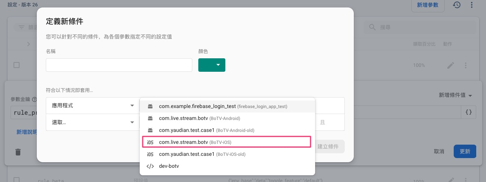

# Remote Config Param Condition

---

## 大綱

- [Remote Config Param Condition](#remote-config-param-condition)
  - [大綱](#大綱)
  - [說明](#說明)
    - [範例](#範例)
  - [修正說明](#修正說明)

---

## 說明

- 文件撰寫時間 : 2021-05-21

簡單講解如何設定 Remote Config 參數中的條件設定。

### 範例

直接用範例來說明操作步驟。

- 1 - 點選 Edit

  在要修改的 Parameter，點選修改的圖示。

  

- 2 - 點選新增條件值

  

- 3-1 (選擇條件項目)

  選擇既有的條件項目，也可以`定義新條件`。

  

- 3-2 (Edit Condition)

  範例 : 選擇應用程式 (選取 iOS 的 Bundle ID)

  

- 3-3 (Edit Condition)

  範例 : 新增子條件

  

- 3-4 (Edit Condition)

  範例 : 想要新增 `版本`

  > 對應 iOS 為 CFBundleShortVersion，以此篩選較符合我們的相容性版本清單設計。

  

- 3-5 (Edit Condition)

  範例 : 設定 `版本` 的指定內容。

  > 以此案例為 `0.1.0` 的 CFBundleShortVersion 會取得對應的設定內容。

  

- 3-6 (Edit Condition)

  範例 : 遇到版本問題。

  > 要支援 條件可設定 `版本`， Firebase iOS Sdk 需要升級。

  

  - 補充:

    後續有同仁測試，實際現象有所出入，可看 [修正說明](#修正說明)。

- 3-7 (Edit Condition)

  範例 : 改設定`版本編號`看看。

  > 沒有問題的話，Sdk 未升級前的過渡期可使用這個替代。

  

- 3-8 (Edit Condition)

  範例 : 對條件做命名。

  > 這邊是假設要給 iOS Review 用的，所以取名為 iOS_Review。

  

- 4 (Edit rule_product iOS_Review Condition value)

  範例 : 修正剛剛新增的 iOS_Review 條件下的內容。

  > 修正完，按下更新，即完成了。

  

- 5 (Conditions Priority)

  可於 Remote Config 的 Conditions 頁籤，

  調整 `條件` 的 `優先序`，優先序越高，表示該條件越前面檢查是否符合。

  

---

## 修正說明

- 時間 : 2021-05-25

- 驗證 : CFBundleShortVersion

  經由同仁驗證，使用 BoTV 專案測試 CFBundleShortVersion 實際上可以使用。

  關鍵性的佐證為，BoTV 專案使用的 Firebase/RemoteConfig SDK 版本，

  是符合支援的版本 (官方說明最低支援為 6.24.0)，該專案使用的為 7.3.0。

  > 所以沒道理不支援。

  - FirebaseRemoteConfig from Podfile.lock

    

- 結論

  Firebase Remote Config 上面的訊息應為警告的提示訊息。

  用意在於檢查使用的 App 是否有使用到該版本以上，

  不過這樣的話，感覺 Firebase Remote Config 上面的訊息有誤導的嫌疑啊。

  如果只是提示，應該說明請檢查客端引用的 SDK 是否有在最低支援版本以上即可。

---

[=> Top](#remote-config-param-condition)

[=> Go Back](../README.md)
