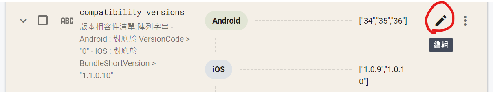

# Remote Config 強更設定

當需要對App 進行強更時，到 Remote Config 進行的相關設定。

- 撰寫文件時間 : 2022-05-27-2022-05-30

## 大綱

- [概念](#概念)
- 操作步驟(順序參考概念內的基本步驟)

---

## 概念

- 目標:在Firebase - RemoteConfig - Conditions 中設定[強更條件]，讓運維在需要強更時能簡單拖拉達成目的

- 基本步驟
    - 先在開啟測試環境 [BoTV-dev] ，在測試環境裡實驗
    - 將上次強更條件相關資訊，帶入標準版本資訊裡
    - [增設本次版本強更條件](#增設本次版本強更條件)
    - [compatibility_versions 新增強更相容參數](#新增強更相容參數)
    - [latest_version 新增強更版本編號](#新增強更版本編號)
    - [測試環境嘗試強更並開啟新舊版本APP確認是否生效](#測試環境嘗試強更並開啟新舊版本APP確認是否生效)
    - 將強更設定帶入正式環境 [BoTV]，但不進行強更
    - [正式環境確認新舊版本都可以正常登入](#正式環境確認新舊版本都可以正常登入)
    - [通知運唯強更已設定](#通知運唯強更已設定)
---
---
## 增設本次版本強更條件

- 位置: Firebase > RemoteConfig > Conditions > 新增條件
    - 也可以將上一次的強更條件直接改名

    

- 新增規則
    - 分平台新增: iOS/Android
    - 名稱規則: [平台]_ForceUpdate_To_[版號]
        - EX: iOS_ForceUpdate_To_1.0.10

    

---
## 新增強更相容參數

- 位置: Firebase > RemoteConfig > Parameters > compatibility_versions > 編輯 > 新增 > 條件值 > 先前新增的強更條件

 

- 新增規則(分平台)

    - iOS

        - 陣列紀錄版號(version number)

            - [本次版本,下個相容版本,預防送審出錯時的再下個版本(可以不用)]

    

    - Android 

        - 陣列紀錄編輯版號(build number)

            - [本次版本,下個相容版本,預防送審出錯時的再下個版本(可以不用)]

    

---
## 新增強更版本編號

- 位置: Firebase > RemoteConfig > Parameters > latest_version > 編輯 > 新增 > 條件值 > 先前新增的強更條件

    

    

     

- 新增規則(分平台)

    - iOS

        - 紀錄強更版號(version number)

    - Android 

        - 紀錄強更編輯版號(build number)

    

---
## 測試環境嘗試強更並開啟新舊版本APP確認是否生效

    - 強更後[舊版]要跳出[版本更新]提示，要求玩家更新版本
    - 強更後[新版]要要能正常登入
    - 強更後[下一個測試版]要要能正常登入

---
## 正式環境確認新舊版本都可以正常登入

    - [舊版]要要能正常登入
    - [新版]要要能正常登入

---
## 通知運唯強更已設定

    - 建議截圖告知運唯已設定完成
    - 正式環境的強更行為交由運唯處理

