# GitLab Publishing Process

這篇主要是說明如何透過 GitLab CI 來出版，

會描述 GitLab CI 出版的流程，

以及出版時，會需要了解的 Tag Name 規則。

> Tag Name 規則是 for BoTV 專案使用，
>
> 不同專案的規則可能有所不同。

---
---

## 大綱

- [GitLab Publishing Process](#gitlab-publishing-process)
  - [大綱](#大綱)
  - [概述](#概述)
  - [GitLab CI 流程](#gitlab-ci-流程)
  - [GitLab Tag Name Rule](#gitlab-tag-name-rule)
  - [附註](#附註)
    - [Guest View For Release](#guest-view-for-release)
    - [Release Position For GitLab 2021-06-15](#release-position-for-gitlab-2021-06-15)
    - [Mac 手動出版](#mac-手動出版)

---
---

## 概述

BoTV 專案使用 GitLab 來管理版控，

而我們的出版也是透過 GitLab 上面的 CI/CD 功能來處理出版。

簡單說明 GitLab CI/CD 流程，細節不贅述，可參考其他文件。

這邊主要以 BoTV 出版時，需要處理的事項以及步驟。

**GitLab CI/CD 概念 :**

- 針對要出版的 Git Commit 打 Tag。

  > 我們設定的 CI/CD 是由 Tag 觸發。

- GitLab 會觸發編譯的共用機 (mac mini)，來執行 `scm/ci.sh` 腳本。

- `scm/ci.sh` 會頗析帶入的 Tag Name，產出對應 tag 內容的 ipa/apk。

- 最後會將 local 端產出內容， scm/output，包成 zip 包上傳到 GitLab 對應的專案中，GitLab 術語為 `Job artifacts`。

---

本文重點接下來會放在下面幾個方向。

- Tag Name 格式說明

  > Tag Name 是有意義的，關於出版以及方便溝通的名詞定義。

- GitLab 網站的操作步驟

  於 GitLab 上面的操作步驟，方便後續人員參考依序處理。

  包含 CI/CD 以及對應的 Release Note 處理。

---
---

## GitLab CI 流程

主要描述目前的 GitLab 網頁上面操作 CI 流程，

並最後會將下載連結，修正到對應的 Release Note 上。

- 截圖日期 : 2021-06-14

**步驟 :**

- 01 : 點選 History

  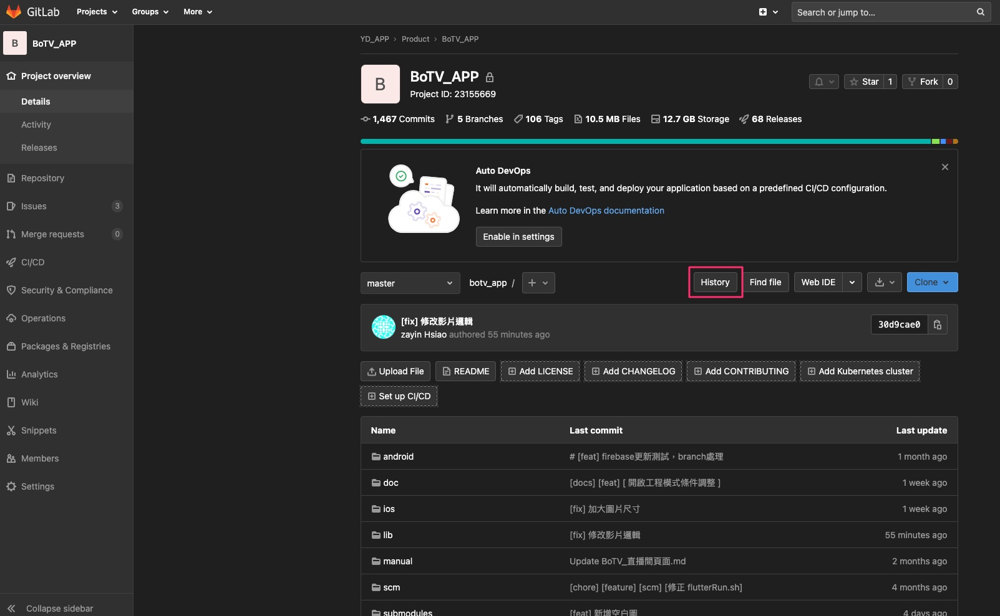

- 02 : 選擇要出的版本

  以 git commit hash 來選擇要出的版本。

  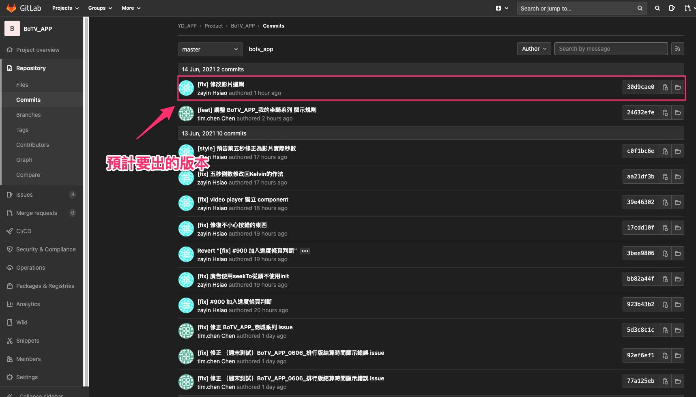

- 03 : 點擊 Tag

  點擊此按鈕，進入建立 Tag 流程。

  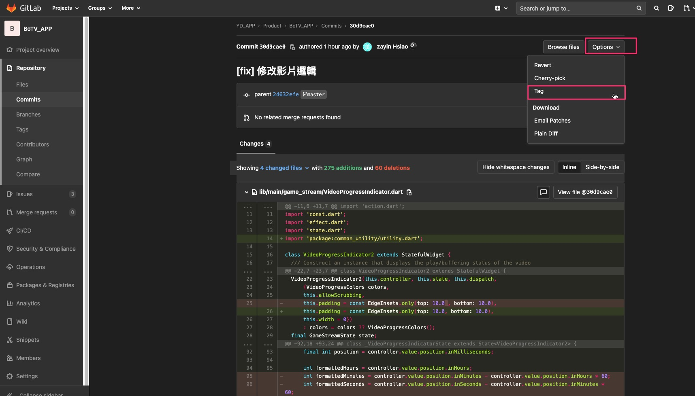

- 04 : New Tag 內容描述

  可看 [GitLab Tag Name](#gitlab-tag-name-rule) 此區塊來了解命名規則。

  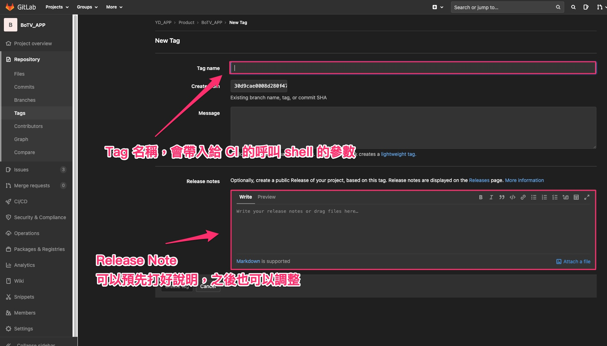

- 05 : 建立 Tag

  此案例 Tag Name : 0.1.0.9.30d9cae.beta.experiment

  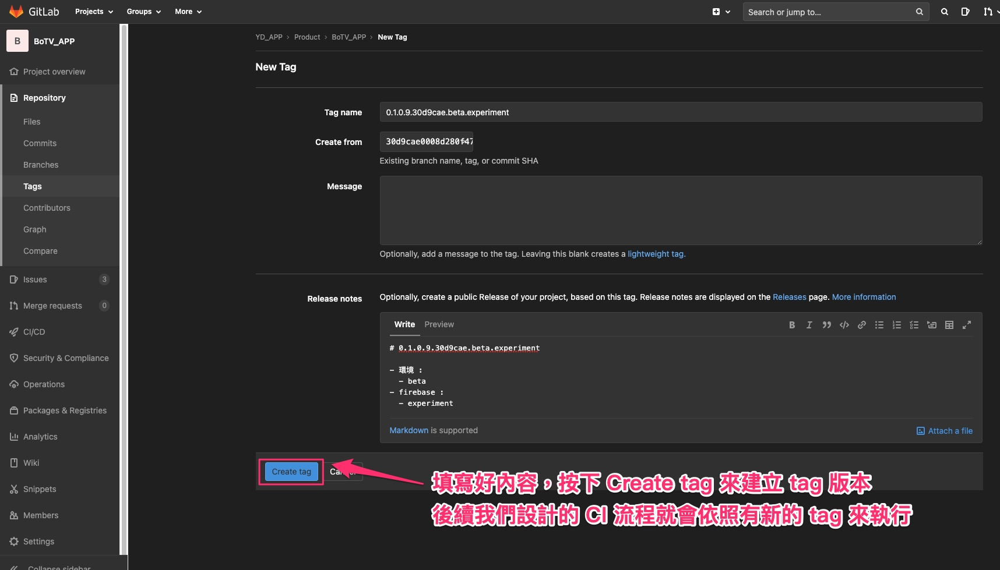

- 06 : 點擊 commit hash 按鈕

  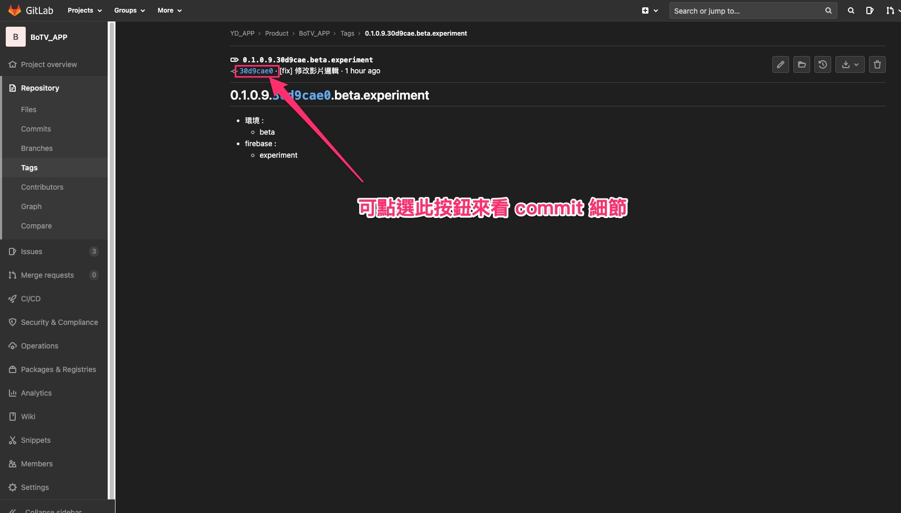

- 07 : 點擊 commit hash 按鈕

  直接點擊 commit hash 對應的按鈕，

  可進入該版本的細項說明。

  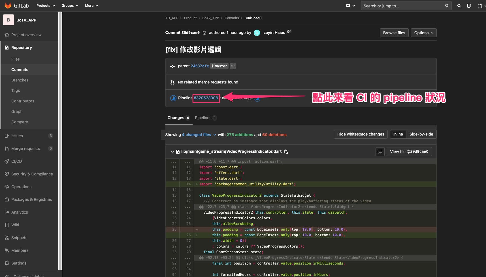

- 08 : 點擊 Pipeline 對應按鈕

  可進入 Pipeline 頁面。

  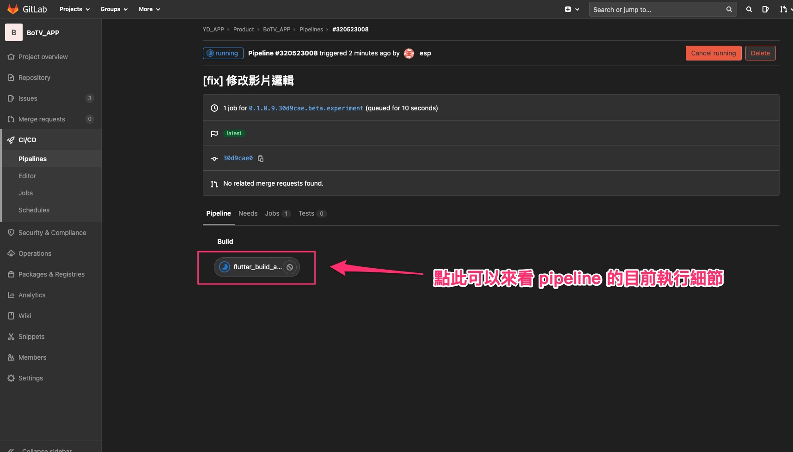

- 09 : Pipeline 頁面說明

  Pipeline 正在實行時，可觀察執行的狀態。

  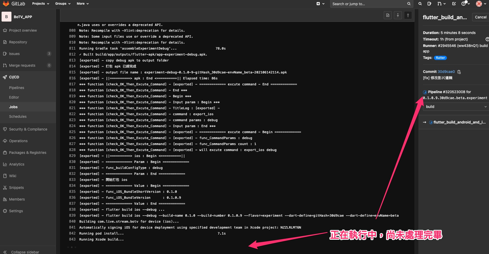

- 10 : Pipeline 完成

  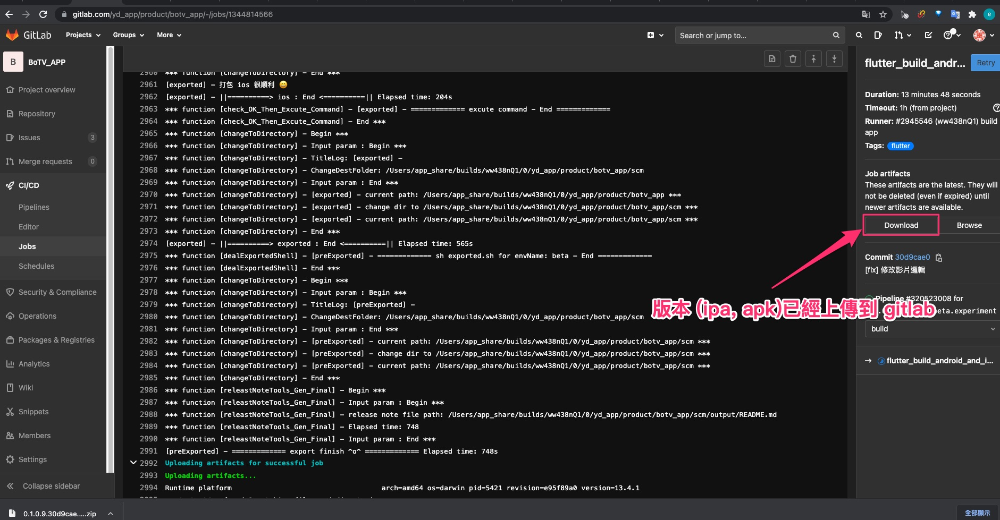

- 11 : 複製下載連結

  複製下載連結，此下載內容即為剛剛打包上傳的 zip 包，

  內容會有對應產出的 ipa，apk 還有說明等。

  > 需要在此 copy url link，
  >
  > 主要是因為我們很常會有同一個 commit hash 建立多個 tag，
  >
  > 而 Gitlab 網頁，在他的 [Repository][Tags] 頁面，
  >
  > 在此種情境下的下載連結，不同的 tag，對應同一個 commit hash，
  >
  > 其下載的連結都會對應到最後打得 Tag，
  >
  > 比較傾向是 gitlab 網頁的 bug。
  >
  > 在這邊 copy 就不會有問題，故統一於此 copy url，
  >
  > 可保證不會出錯。

  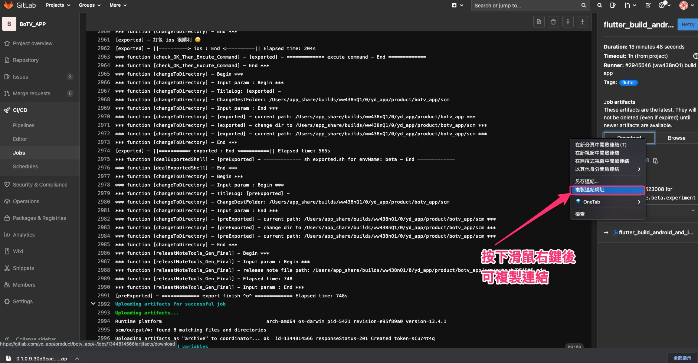

- 12 : 修正 Release 內容

  新增下載連結設定。

  > Release 於 2021-06-15 網站位置有換新地方
  >
  > 相關說明可看 [Release Position For GitLab 2021-06-15](#release-position-for-gitlab-2021-06-15)

  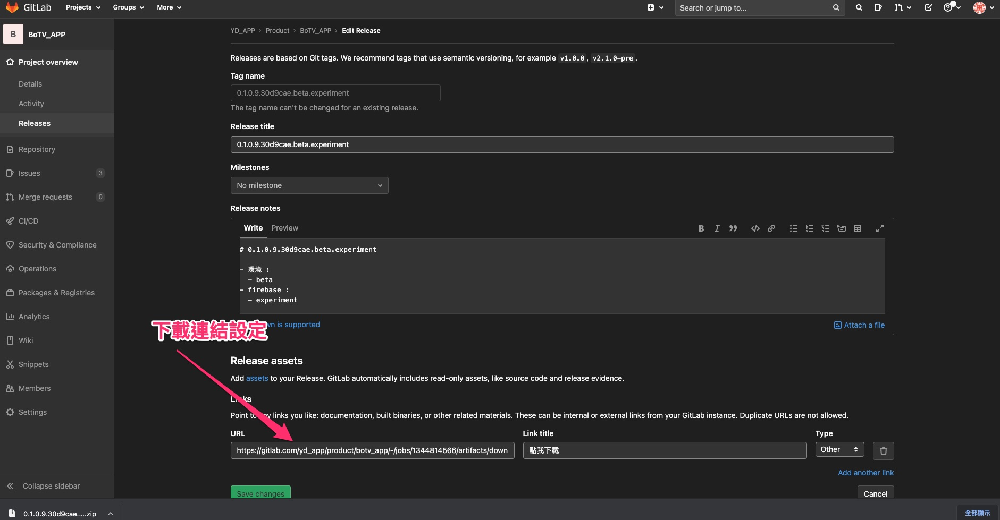

- 13 : Read Release Content

  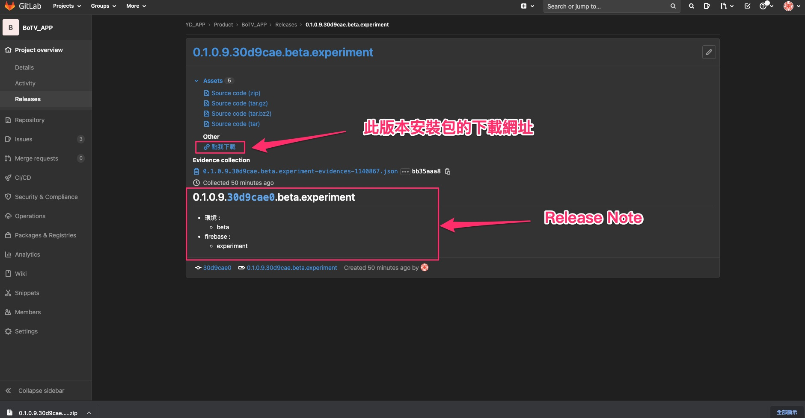

---
---

## GitLab Tag Name Rule

目前 Tag Name 格式定義如下 :

[版本].[GitShortHash].`[envNames]`.`[flavorNames]`

主要需分四個部分。

其中 `[envNames]`，`[flavorNames]`，比較特別，可設定多個。

一個簡單範例如下 :

> 0.1.0.9.ab9e0bd.beta.experiment
>
> - 版本 : 0.1.0.9
>
> - GitShortHash : ab9e0bd
>
> - envNames : beta
>
> - flavorNames : experiment

- 版本

  這邊的版本以 Flutter 專案的設定為主，

  對應於 Flutter 專案中的 pubspec.yaml 的版本。

  version 格式 : [BuildName]+[BuildNumber]

  > e.g. version: 0.1.0+9

  而版本需調整為 [BuildName].[BuildNumber]

  > e.g. 0.1.0.9
  >
  > 此版本亦會在 App 的登入頁面下方顯示版本資訊的一環。

  需手動對應，編譯腳本會自動頗析 pubspec.yaml，

  由於最後要打包的 zip 包名稱與 TagName 是有相關性。

  故此 TagName 的需要相同，用意為方便對照版本資訊，

  以及避免造成誤解。

  version 的拆解，對於 Android 以及 iOS 分別有不同的原生對應方式處理，

  實際會於 `scm/ci.sh` 來負責銜接處理。

  > 這邊不贅述實際的對應，有興趣者可自行了解該腳本的運作流程。

- GitShortHash

  為 Git 的 Commit Short Hash 資訊，

  也是需要手動處理，編譯腳本會自動抓取，

  用意與版本相同，方便對照版本資訊。

  > shell 中會呼叫 `git show -s --format=%h` ，
  >
  > 來取得 git commit short hash。
  >
  > 實測此命令會得到 7 位數的 hash code。

- envNames

  要出版的環境，目前支援的環境清單，

  可參考 pubspec.yaml 中的 `scm` 區塊中的 `env_names`，

  此為目前支援的`環境名稱清單`。

  若沒有設定到相關的，則會全部產出。

  > e.g. xxx.beta.product
  >
  > 則會產出 envName 為 beta 以及 product 兩組版本。
  
- flavorNames

  主要用途為對應的 flavor 版本，

  > Android 為 flavor，iOS 為 custom Xcode schemes

  BoTV 的 flavor 差異：主要用在對應於 Firebase 專案以及 FB Develope App 專案上的不同。

  可參考 pubspec.yaml 中的 `scm` 區塊中的 `flavors`。

  若沒有設定到相關的，則會全部產出。

  > e.g. xxx.official.experiment
  >
  > 則會產出 flavor 為 official 以及 experiment 兩組版本。

---
---

## 附註

### Guest View For Release

上面的帳號權限，皆以 Developer 以上的權限來截圖，

而 Release Note 有可能會開放給 Guest 權限的帳號來使用。

這邊稍微解釋一下若以 Guest 帳號來觀看 Release，

會出現什麼的變化。

- 01 : Release Note 說明

  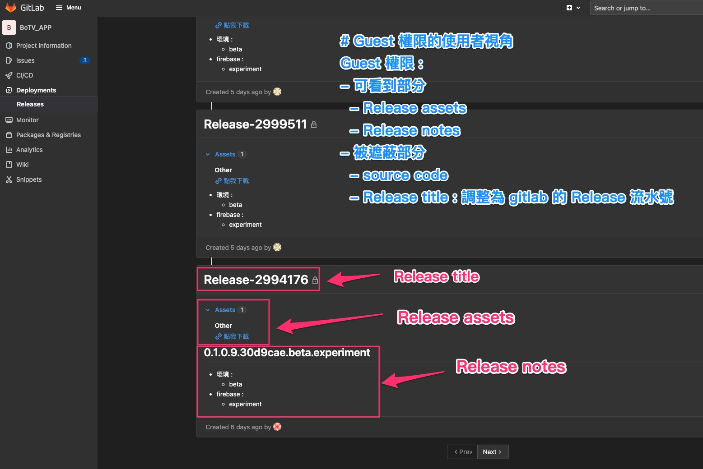

  Release 主要三個區塊如下 :

- 說明 :

  - Release title :

    預設會自動與 Tag Name 相同，但 Guest 帳號只看得到 GitLab 建立的流水號。

  - Release assets :

    Guest 帳號只能看到附加上去的下載連結，其餘皆看不到。

    > 有關 source code 部份會屏蔽掉。

  - Release note :

    Guest 帳號可以看到完整的 Release note 內容。

---

### Release Position For GitLab 2021-06-15

在 `2021-06-15` 於 GitLab 網站觀看時，

發現 Release 的位置被改變了。

這邊說明一下新的位置放置於哪。

- 01 : New Position => [Deloyments][Releases]

  新的位置在左側 [Deloyments] 的子項目 [Releases] 中。

  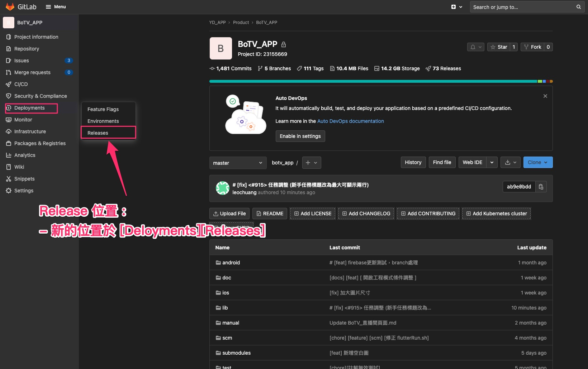

- 02 : 修正 Release 內容

  Relese 內容與之前相同，修正下載連結設定方式不變。

  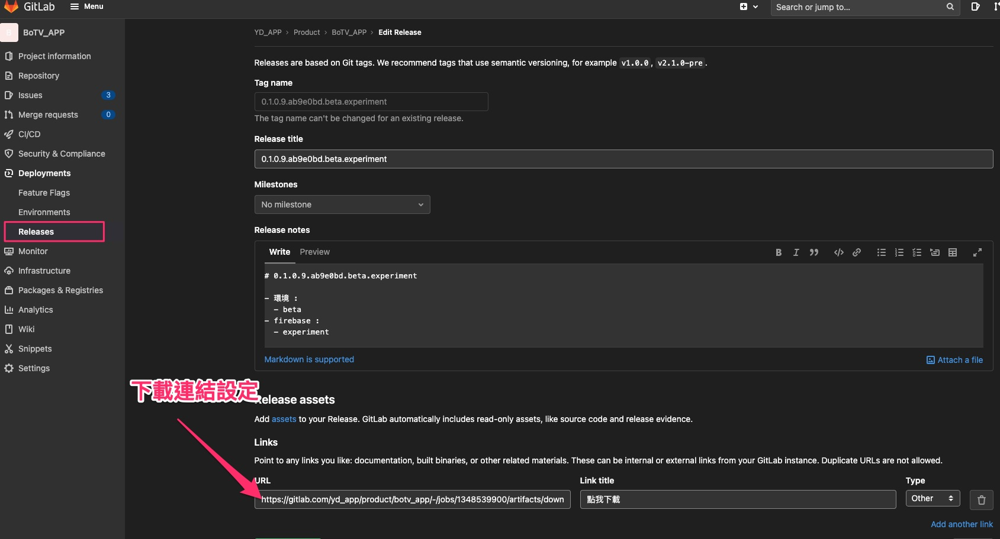

- 03 : Read Release Content

  同之前的內容。

  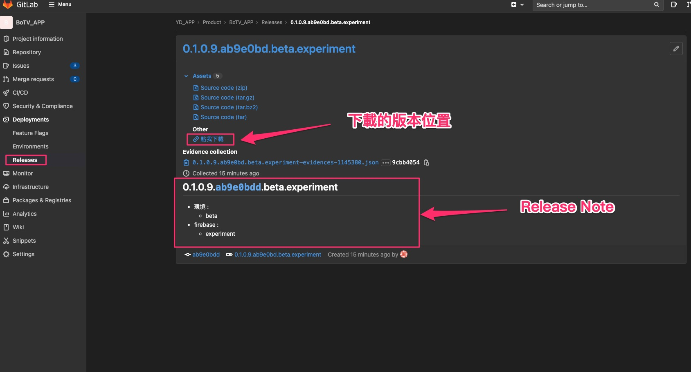

---

### Mac 手動出版

若臨時遇到問題需要手動出版，

或自己想要在本地端出版來試試看，

在 mac 的環境下，

> 前提是一些環境是比照 `開發機/共用機` 的設定。

可以比照 Tag Name 的原則，

呼叫 `scm/ci.sh` 帶入 `TagName` 參數，

即可產出對應的版本，出版的東西會放在 `scm/output` 資料夾下。

---
---

[=> Top](#gitlab-publishing-process)

[=> Go Back](../README.md)
