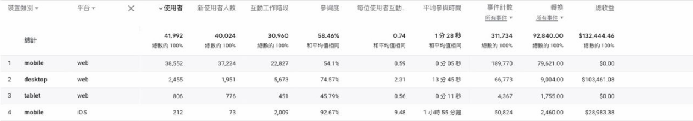

# Google Analytics Data Display Issue

---

## 大綱

- [Google Analytics Data Display Issue](#google-analytics-data-display-issue)
  - [大綱](#大綱)
  - [說明](#說明)
  - [結論](#結論)
  - [參考](#參考)

---

## 說明

EP 同步，客戶(營運方) 提出一個問題，關於五月的部分GOOGLE分析，安卓的數據沒有跑出來。

- 發生時間 : 2022-06-01

- 初始資訊 :

  EP :

  > 客戶反應五月的部分GOOGLE分析，安卓的數據沒有跑出來
  >
  > 紅色框框的部分是四月的對比圖，要麻煩協助查看一下，謝謝

  - 五月圖表

    

  - 四月圖表

    

- 討論圖表來源網址 :

  從內容不太容易對接到 Google Analytics 上面的資訊，

  > Google Analytics 上面資訊太多，沒說明清楚哪一頁，可能會找很久。

  討論後， EP 有回饋對應的資訊。

  - 提供的圖表截圖 :

    

  - 對應的網址 :

    [Analytics (分析) | 技術詳情: 平台]

    > <https://analytics.google.com/analytics/web/#/p246968050/reports/explorer?params=_u..nav%3Dmaui%26_r.explorerCard..selmet%3D%5B%22conversions%22%5D%26_r.explorerCard..seldim%3D%5B%22platform%22%5D&r=user-technology-detail&ruid=user-technology-detail,user,technology&collectionId=2699030305>

- 分析 :

  分析該頁面，上方有個提示有點有趣。

  感覺是資料量過少，所以無法顯示。

  - 警告訊息

    

- 測試 :

  將收尋日期 : 從原先的 5/4 ~ 5/31 ，

  調整為 5/1 ~ 5/31。

  Andorid 的資訊就出現了。

  - 調整日期範圍的結果

    

---

## 結論

從測試結果看起來，確實資料量，會影響顯示資訊。

後續有調整 5/25~5/31，會連原本有資料的 iOS，也消失了。

所以應該就是此原因了。

---

## 參考

- [Analytics (分析) | 技術詳情: 平台]

- [[GA4] 数据限额 - Google Analytics（分析）帮助][\[GA4\] 数据限额 - Google Analytics（分析）帮助]

  > 警告資訊，關於 `已套用門檻` 的詳情資訊說明。

---

<!-- 連結設定 -->
[Analytics (分析) | 技術詳情: 平台]:
  https://analytics.google.com/analytics/web/#/p246968050/reports/explorer?params=_u..nav%3Dmaui%26_r.explorerCard..selmet%3D%5B%22conversions%22%5D%26_r.explorerCard..seldim%3D%5B%22platform%22%5D&r=user-technology-detail&ruid=user-technology-detail,user,technology&collectionId=2699030305

[\[GA4\] 数据限额 - Google Analytics（分析）帮助]:
  https://support.google.com/analytics/answer/9383630

[=> Top](#botv-google-analytics-issue)

[=> Go Back](../README.md)
