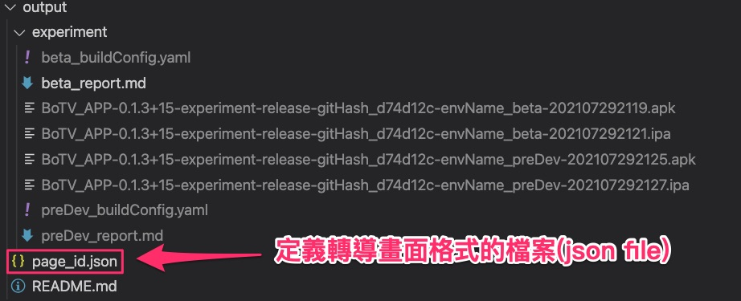
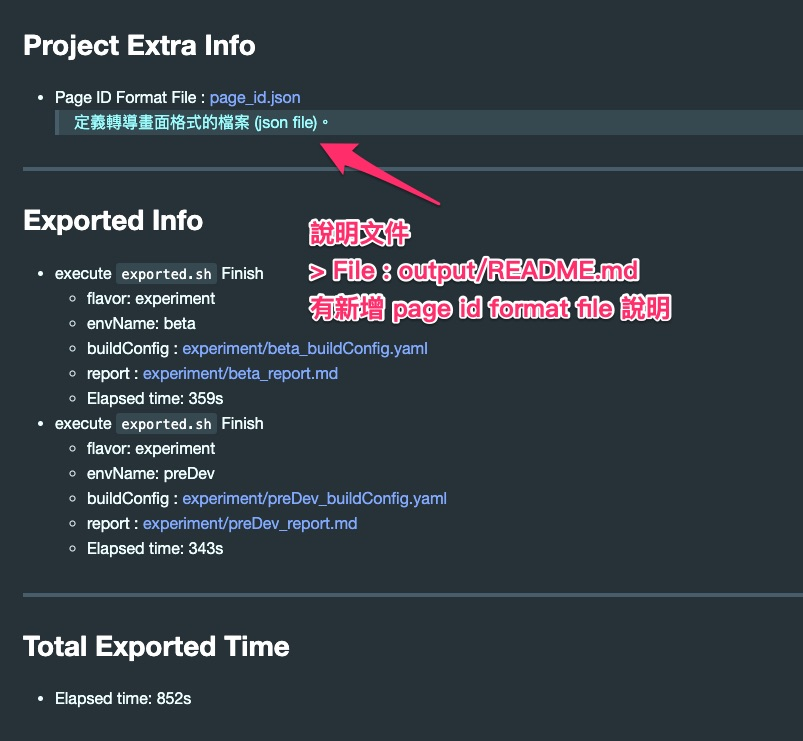

# App 包版包含`轉導畫面格式文件`說明

  > 2021-07-30 完成文件撰寫。 需求來自 [(#1039) 預約推播 _ 已預約的直播間 及 已追蹤的直播主上線]

---

## 概要

- 撰寫文件時間 : 2021-07-30

App 包板的資料夾新增 `轉導畫面格式文件` 。

- 用途 :

  - App 使用 :

    此檔案為 App 實際的使用該內容來判斷轉導畫面的方式。

    > 包含跳轉 App 內部頁面 或 內開/外開 網頁 等等。

  - 後端 :

    後台會放入此檔案跟個後台網站一起上版，

    會依據此檔案來產生後台的設定選項。

- 範本 :

  ```json
  {
      "version":"1.0",

      "pid000": { "page":"WebOutsidePageID", "name":"外開網頁",   "desc":"外開網頁", "content":{"url":"https://www.google.com"} },
      "pid001": { "page":"WebInsidePageID" , "name":"內開網頁",   "desc":"內開網頁", "content":{"url":"https://www.google.com"} },
      "pid002": { "page":"GameStreamID"    , "name":"指定直播間",   "desc":"直播間"  , "content":{"roomID": "test006@livemaster.fymedia"} },

      "pid010": { "page":"ExplorePageID" , "name":"探索",   "desc":"探索頁面首頁" },
      "pid011": { "page":"SchedulePageID", "name":"節目表", "desc":"節目表首頁"   },
      "pid012": { "page":"LivePageID"    , "name":"直播",   "desc":"直播首頁"     },
      "pid013": { "page":"DepositPageID" , "name":"儲值",   "desc":"儲值首頁"     },
      "pid014": { "page":"UserPageID"    , "name":"我的",   "desc":"我的首頁"     }
  }
  ```

- 輸出的資料夾結構 (output folder) :

  Sample :

    

- 輸出的 Release Note 新增說明區塊

  Release Note : 位於 output/README.md

  關於 `轉導畫面格式文件` 位於該說明區塊的 Project Extra Info 中。

  - Sample :

    

---

## 轉導頁面 json file 異動規則

- 撰寫文件時間 : 2022-04-14

  > 轉錄自 [大事紀 2021-08-12] 內容。

- pid 異動原則 :

  - 同一個 pid ，意義相同

    - 可擴充，用擴充

    - 不行新增 pid

  - 意義不同則新增 pid

- 版號異動原則 :

  - version : [主版號].[次版號]

  - 更動類型 :

    - 新增 pid 改主版號 (同時次版號歸零)

    - 更動內容改次版號

---

## 參考

- [(#1039) 預約推播 _ 已預約的直播間 及 已追蹤的直播主上線]

- [(#1039) comment : App 包版包含`轉導畫面格式文件`說明]

  > 本說明的主要內容也 copy 一份到該 issue 上。

---

<!-- 連結設定 -->

[(#1039) 預約推播 _ 已預約的直播間 及 已追蹤的直播主上線]:
  https://gitlab.com/championgameteam/production/devops/test-lib/-/issues/1039

[(#1039) comment : App 包版包含`轉導畫面格式文件`說明]:
  https://gitlab.com/championgameteam/production/devops/test-lib/-/issues/1039#note_639255232

[大事紀 2021-08-12]:
  ../Memorabilia/2021-08/2021-08-12/README.md

[=> Top](#app-包版包含轉導畫面格式文件說明)

[=> Go Back](../README.md)
