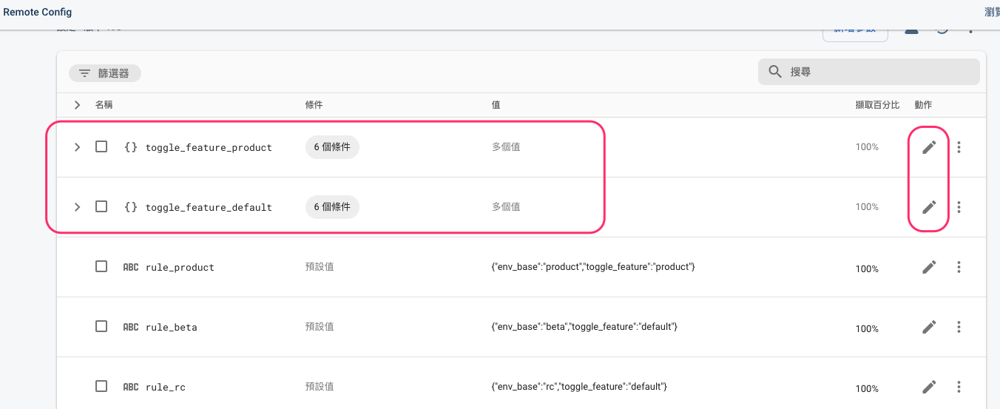

# Toggle Feature 程式面攥寫指引

- [Toggle Feature 程式面攥寫指引](#toggle-feature-程式面攥寫指引)
  - [概要說明](#概要說明)
  - [必要條件](#必要條件)
  - [提升版本新增 Toggle Feature](#提升版本新增-toggle-feature)
  - [調整可視化管理資訊](#調整可視化管理資訊)
  - [調整 Firebase 的設定](#調整-firebase-的設定)
  - [Webapi在Product環境下指定使用Beta環境的url設定方式](#webapi在product環境下指定使用beta環境的url設定方式)
  - [參考](#參考)

## 概要說明

> 此功能主要是與 FRC(Firebase Remote Config) 結合使用，從 FRC Fetch到設定值並解析後設定至
> 對應的 Toggle Feature 來進行功能啟用的控制
>
> 會需要這樣設定主要原因是因為可能在送測流程時，同時需要開發下一個版本的功能，此時因為可能還需要修
> bug並重新包版的緣故，App版本還不能提升上去但又要同時開發下一版，故使用 ToggleFeature 控制功能
> 的啟用或停用
>

- 用法範例：

``` dart
///  ToggleFeature_1_0_8.getIsEnable() 
///  取得布林值做控制功能啟用於否

if(ToggleFeature_1_0_8.getIsEnable()) {
    ...
    ...
    ...
} else {
    ...
}
```

## 必要條件

- pubspec.yaml 提升版本


## 提升版本新增 Toggle Feature

> 以 1.0.7 版本為例，須新增 ToggleFeature_1_0_8，並將設定為 developMode,
> 而 ToggleFeature_1_0_7 則為 onlineMode


> onlineMode 會使用 botv 的 firebase - official 及 experiment 所設定的 FRC 的值
>
> developMode 則僅會 firebase - experiment 所設定的 FRC 的值

## 調整可視化管理資訊


## 調整 Firebase 的設定

- 在 botv 和 botv-dev RemoteConfig -  Conditions 新增 (完全相符版本1.0.7) 雙平台


- 在 toggle_feature_product 及 toggle_feature_default 新增兩條件下的需要的值




> 以 toggle_features.dart 檔案中所需的值為主，當然也可以移除不必要的 ToggleFeature
> ，例如已經確定不會在線上做啟用或取消功能的 ToggleFeature

## Webapi在Product環境下指定使用Beta環境的url設定方式

- 使用緣故

> 主因是因為Beta環境下開發的Webapi 可能在APP送審時，仍未發布至product，
> 故需先將送審版的APP設定為指向到 review-prod 環境，這樣APP依賴於變更或是新開發的WebApi的功能才能夠正常使用，也才能送審。

- 特別注意

> 僅需設定在 Firebase - Botv 專案 (official)

- env_base_info_review_product 的值


- 此為 assign_env_base_infos 中 對應到 env_base_info_review_product 的 key 為 review_prouct


- 設定送審環境步驟一


- 設定送審環境步驟二


> 當送審通過後，待變更或新增 Webapi 發佈到 Product，就可以修改回來 product 了

## 參考

> 相關 [commit](https://gitlab.com/yd_app/product/botv_app/-/commit/ee7c5f42ff20e73ad74f6ec6b34754d7f038e52e)

---

[=> Top](#toggle-feature-程式面攥寫指引)

[=> Go Back](../README.md)