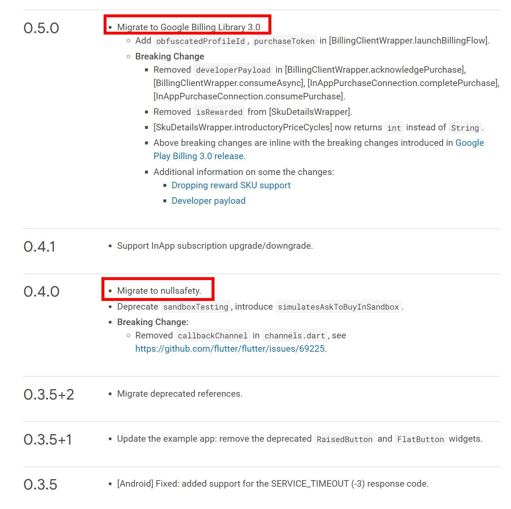
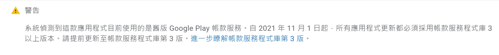
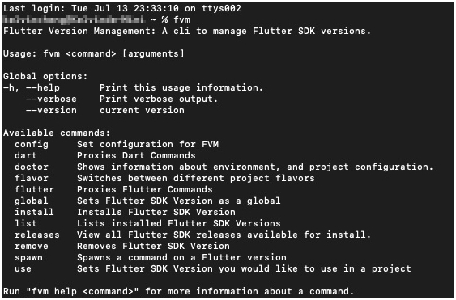
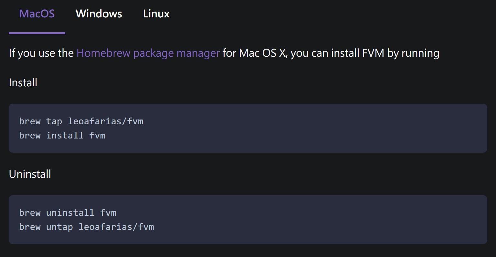
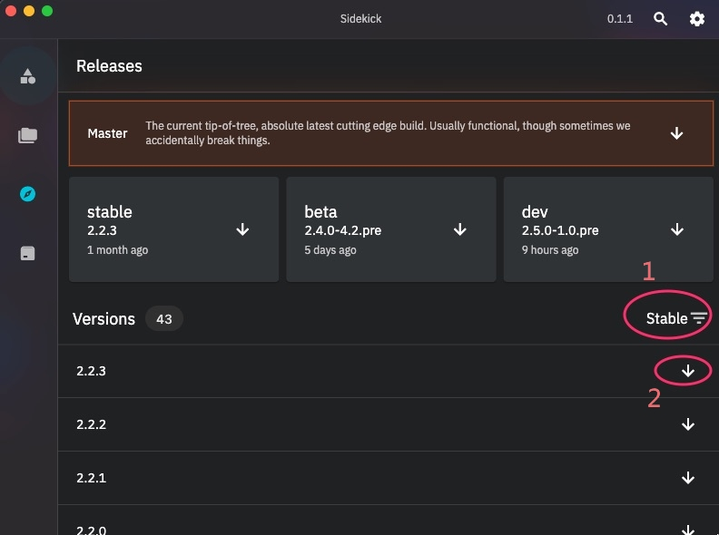
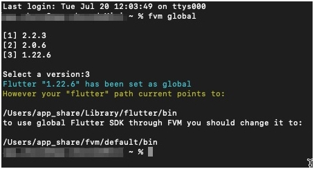
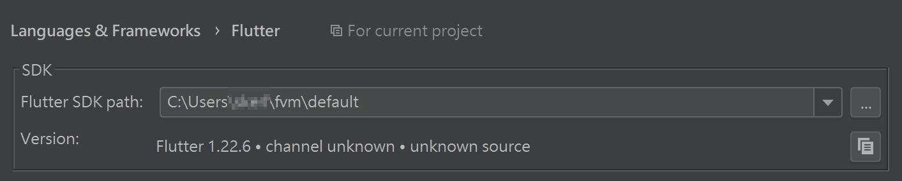
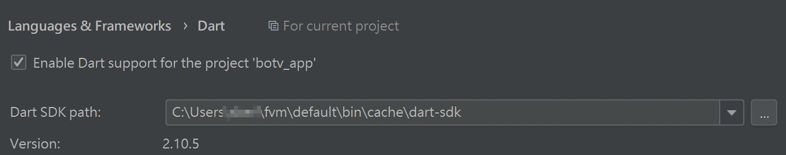
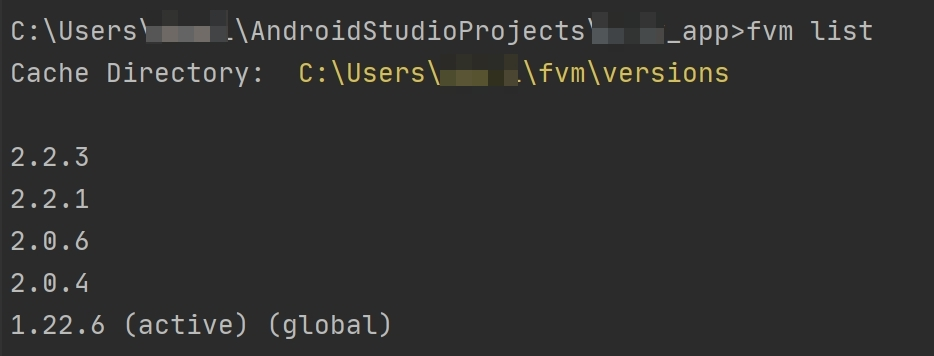
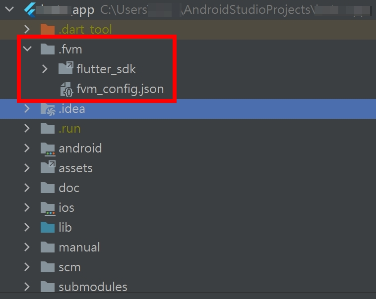

# **Flutter 1.22.6 遷移至 Flutter 2.2.3 指導手冊**

- [**Flutter 1.22.6 遷移至 Flutter 2.2.3 指導手冊**](#flutter-1226-遷移至-flutter-223-指導手冊)
  - [**必須升級的理由**](#必須升級的理由)
    - [**參考(a)**](#參考a)
  - [**遷移前需了解並做的事**](#遷移前需了解並做的事)
    - [**專案分支**](#專案分支)
    - [**升級 Flutter 2.0 的重大改更**](#升級-flutter-20-的重大改更)
    - [**Sentry 崩潰分析回報套件**](#sentry-崩潰分析回報套件)
    - [**使用 FVM 快速切換 Flutter 版本**](#使用-fvm-快速切換-flutter-版本)
    - [**FVM 使用情境**](#fvm-使用情境)
    - [**參考(b)**](#參考b)
  - [**遷移中要做的事**](#遷移中要做的事)
    - [**Upgrade Flutter SDK**](#upgrade-flutter-sdk)
    - [**pubspec.yaml 調整**](#pubspecyaml-調整)
    - [**套件仰賴升級**](#套件仰賴升級)
    - [**程式修改**](#程式修改)
    - [**檢查項目**](#檢查項目)
    - [**參考(c)**](#參考c)

## **必須升級的理由**

- Flutter 許多套件新的版本都已經支援 Null-Safety
  >這些套件依賴 Dart Sdk >= 2.12.0，而需要升級到 flutter 2才能取得，若套件有修復一些bug或是新功能，想要升級依賴這些版本，若沒升級到flutter 2 是不能的。
  >
- Google 要求 IAP(In App Purchase)套件升級至V3
  >新的app於2021-08開始要使用V3版才能發佈
  >已存在的app則於2021-11起要使用V3版才能發佈
  >IAP套件支援V3版依賴於Flutter 2
  >

### **參考(a)**

- [New Android App Bundle And Target Api](https://android-developers.googleblog.com/2020/11/new-android-app-bundle-and-target-api.html)

---

## **遷移前需了解並做的事**

### **專案分支**

- botv_app
  - master (flutter 1.22.6)
  - upgrade_to_flutter2 (flutter 2.2.3)

- git submodules
  > 以下的 repository 中也有開啟新分支來遷移至 flutter 2

  - yd_app.commonutility
  - fish-redux
  
  > 以下是從 submodule 中移除的 repository

  - flutter_wechat_assets_picker
    > 移除原因 : video_player 2.1.8 [已經修復 HLS on iOS](https://github.com/flutter/plugins/pull/3360)

### **升級 Flutter 2.0 的重大改更**

> Flutter 此次有相當多的重大變更，例如廢棄方法，Widget 的 Clip 的行為改變等...
>
> 所以需要詳細了解重大變更的項目以利遷移後能正常的運作

---

- 專案內重要異動的項目

  - 部門內 Github 上的 Fish-Redux 方法更改

    ``` diff

    --- lib/src/redux_component/page.dart:208 ---

      static PageProvider tryOf(BuildContext context) {
        final PageProvider provider =
    -        context.inheritFromWidgetOfExactType(PageProvider);
    +        context.dependOnInheritedWidgetOfExactType<PageProvider>();
        return provider;
      }
    ```

### **Sentry 崩潰分析回報套件**

> 目前已經在 upgrade_to_flutter2 分支中加入了 [Sentry](https://sentry.io/welcome/) 做為 Crashlytics Report 的系統

### **使用 FVM 快速切換 Flutter 版本**

- 使用原由
  > 因為我們可能會同時讓 flutter 1 (master) 及 flutter 2(upgrade_to_flutter_2) 共存一段時間
  >
  > 避免 flutter 2 突然遇到問題無法處理，還有 master 可以用，但轉換 flutter sdk ver. 非常秏時
  >
  > 故使用這套可快速切換，省去切換版本的時間，且未來若有不同專案間有多個版本共存，也可支援

- FVM(Flutter Version Management) 必要安裝
  - FVM 目標版本 : 2.2.2
  
  
  - 安裝套件管理工具
    - Windows 請安裝 [choco](https://chocolatey.org/about)
    - Mac 請安裝 [brew](https://brew.sh/index_zh-tw)
  - 使用套件管理工具 [安裝fvm套件](https://fvm.app/docs/getting_started/installation/)
    - 僅示意Mac，其他系統請看參考的連結
      

        ``` text
        從 Windows 的終端機執行 fvm 需要以系統管理員身份執行
        ```

- Flutter Sidekick(GUI of FVM)
  - Sidekick 目標版本 : 0.1.1

    
- [安裝 Sidekick](https://github.com/leoafarias/sidekick/releases/latest)
  - MacOS : sidekick-macos-0.1.1.dmg
  - Windows : sidekick-windows-0.1.1.msix
- 安裝以下 Flutter 版本 (Stable Channal)
  - 安裝方法
    - 可使用 fvm install 1.22.6
    - 或使用 Sidekick
  - 必要版本列表
    - 1.22.6
    - 2.0.6
    - 2.2.3

- 設定終端機預設Flutter版本

  - 使用 fvm global 設定，可先設 1.22.6
  
    

  - 結束前套件會告訴你需要修改預設的Flutter路徑

- 變更設定 Flutter SDK 位置
  - fvm cache 預設資料夾位置

      ```text
      Windows OS : c:\Users\%USERNAME%\fvm\default\bin
      Mac OS     : /Users/$USER/fvm/default/bin
      ```

  - 移除原本下載的 Flutter SDK
    > 看開發人員自己下載的位置去刪除
    >
    > 當然也可以移動位置先做備份，若有狀況可立即還原

  - 需要變更設定的部份
    - 系統環境變數
      >Windows : path 變數
      >
      >Mac     : .zshrc , .bash_profile ...
    - IDE(ex. Android Studio, VScode...)
      
      

### **FVM 使用情境**

- 切換不同分支或不同產品時，使用定義 Global 版本

  - 用途：適合 `IDE Plugin Run App` 及 `手動包版`

  - 設定方式
  
  ``` sh
  #執行以下命令指定或選擇版本

  fvm global 2.2.3
  or
  fvm global
  ```

  - 查詢已安裝版本 及 global版本
  
  ``` sh
  fvm list
  ```

  
  - 使用方法
  
  ``` sh
  # 如同一般使用 flutter 的方式

  flutter run
  or
  flutter doctor
  ```

- 切換不同分支或不同產品時，使用定義 Project 版本

  - 用途：適合 `手動包版` 及 `腳本包版`

  - 設定方式
  
  ``` sh
  # 在命令列中移至專案路徑內執行以下命令
  # 會自動生成此專案使用的設定檔

  fvm use 2.2.3
  ```

    

  - 設定 gitignore

  ``` bash
  # 此檔案是 fvm 的 symbol link，因 MacOS 和 Windows 及不同使用
  # 者之間 Flutter SDK cache 的位置皆不同，為了使在不同電腦及系統
  # 間皆可使用，必須讓他自動由所在環境生成連結，故不能commit上傳此檔。

  .fvm/flutter_sdk
  ```

  - 使用方法
  
  ``` sh
  # 使用 flutter 的方式前綴加 fvm
  
  fvm flutter run
  or
  fvm flutter doctor
  ```

### **參考(b)**

- 快速切換Flutter版本

  - [Flutter Version Management installation](https://fvm.app/docs/getting_started/installation)

  - [Flutter Version Management](https://github.com/leoafarias/fvm)

  - [Flutter Sidekick(GUI of FVM)](https://github.com/leoafarias/sidekick)

- [升級 Flutter 2 重大改更](https://flutter.dev/docs/release/breaking-changes)

---

## **遷移中要做的事**

### **Upgrade Flutter SDK**

> 目標版本：2.2.3
>
> 備選版本：2.0.6 ( 萬一 2.2.3 有很多問題就用這個吧!! )

### **pubspec.yaml 調整**

- Dart Version:

``` yaml
environment:
  sdk: ">=2.12.0 <3.0.0"
```

### **套件仰賴升級**

> 這已經調整好大部份的套件到最新版( 請參照 Git Log Diff)，其他若未調整，可視狀況提升或降低

### **程式修改**

- Sound Null-Safety 設定
  - JSON 相關檔案修改
  > 因為套件產生 g.dart 是以 null-safety 為主
  >
  > 所以必須讓原檔符合 Null-Safety 的規範
  >
  >可參考 upgrade_to_flutter_2 分支的 [548e0ab](https://gitlab.com/yd_app/product/botv_app/-/commit/548e0ab91a5f4f745eb48935024435765adee36c)

  ``` diff
  @JsonSerializable()
  class SetMemberRelationship {
  -  String memberID;
  -  String targetID;
  -  int relationship;
  +  String? memberID;
  +  String? targetID;
  +  int? relationship;

  SetMemberRelationship(
      {this.memberID, this.targetID,  this.relationship});

  ```

- Unsound Null-Safety 設定

  > 因專案內某些依賴的套件至今仍未支援 Null-Safety，而且修改所有檔案支援 Null-Safety
  >
  > 又相當秏時，非短時間可完成，故使用官方提供了一個兼容做法 Mix-Version Programs，
  >
  > 此做法是在檔案最頂端加入 @dart=2.9 宣告此檔案使用 dart 2.9 ，即此檔案不會被要求程式
  >
  > 碼在 pubspec.yaml dart >= 2.12.0 以上而必須符合 Null-Safety 的規範，編譯仍然不會有錯誤而且可以包版
  >
  > 但仍要注意的是，如果你使用的套件是 Null_safety，且參數要求為 Non-Null，如果入傳入 null object 則會發生錯誤
  >
  > 可參考 upgrade_to_flutter_2 分支的 [382bfff](https://gitlab.com/yd_app/product/botv_app/-/commit/382bfff231215f08df176aff6ae329fe470588ea)

  ```dart
  // @dart=2.9    <---- 加入此行

  import 'package:flutter/cupertino.dart';
  import 'package:flutter/material.dart';
  import 'package:flutter_screenutil/flutter_screenutil.dart';
  ...
  ...
  ```

- 一般程式碼修改
  - 因遷移而導致方法改變
  - 因遷移而導致方法棄用

### **檢查項目**

- scm 的調整
  > 在 flutter 前加 fvm 前綴

- APP各項功能全測

- 包版測試(包含加入產出aab)
  > 共用機已經安裝 fvm

### **參考(c)**

- [Null-Safety](https://dart.dev/null-safety)

- [Unsound Null-safety](https://dart.dev/null-safety/unsound-null-safety)

---

[=> Top](#flutter-1226-遷移至-flutter-223-指導手冊)

[=> Go Back](../README.md)