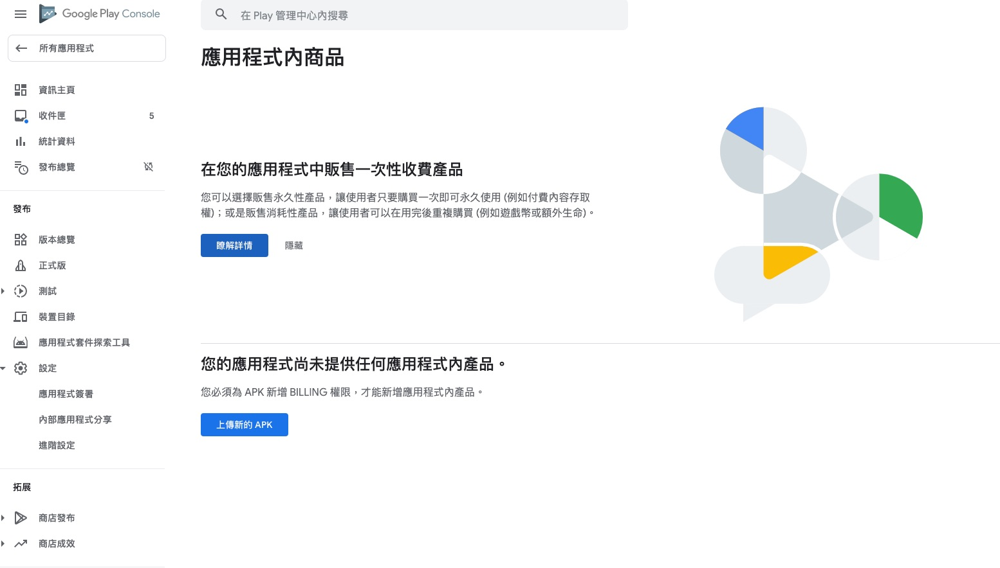
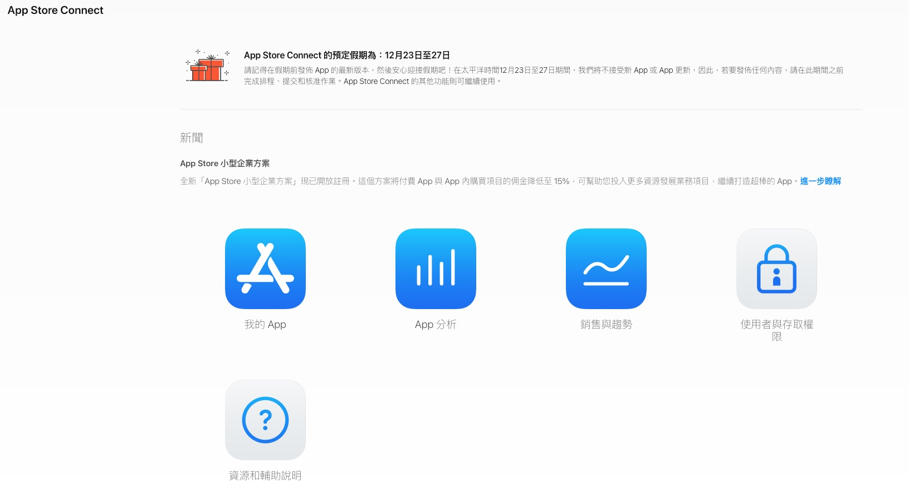
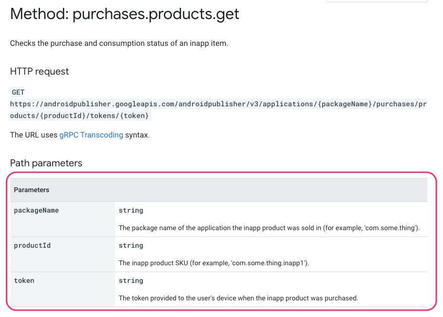
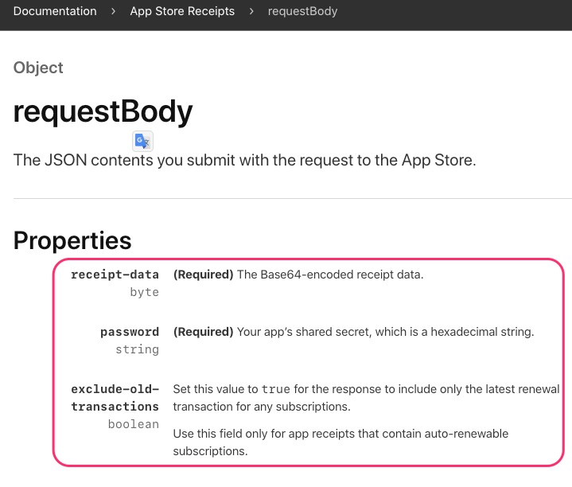
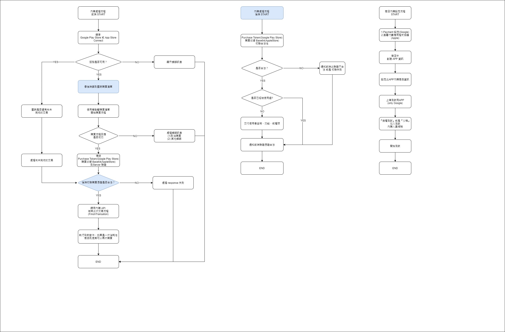
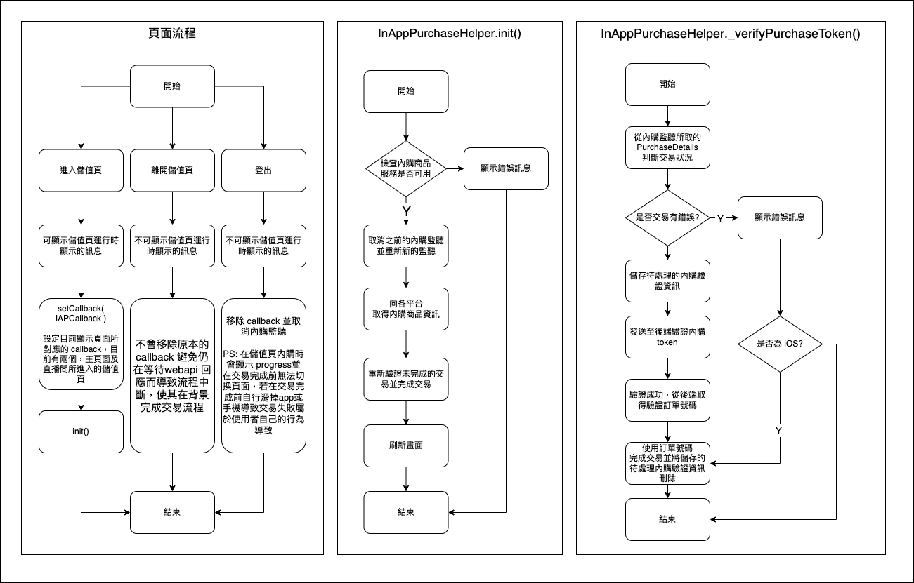

# 1. IAP (In App Purchase) 手機內購 (應用程式內商品)

## 1.1 大綱

- [1. IAP (In App Purchase) 手機內購 (應用程式內商品)](#1-iap-in-app-purchase-手機內購-應用程式內商品)
  - [1.1 大綱](#11-大綱)
  - [1.2 Google Play Store (Android)](#12-google-play-store-android)
    - [1.2.1 販賣數位商品概觀](#121-販賣數位商品概觀)
    - [1.2.2 Google Play 的開立帳單概觀](#122-google-play-的開立帳單概觀)
    - [1.2.3 應用程式內商品設定](#123-應用程式內商品設定)
  - [1.3 App Store (IOS)](#13-app-store-ios)
    - [1.3.1 販賣數位商品概觀](#131-販賣數位商品概觀)
    - [1.3.2 應用程式內商品設定](#132-應用程式內商品設定)
    - [1.3.3 Q&A](#133-qa)
  - [1.4 驗證 Purchase Token(Google Play) 和 Purchase Receipt (App Store)](#14-驗證-purchase-tokengoogle-play-和-purchase-receipt-app-store)
  - [1.5 Google Play Billing 和 AppStore 系統運作流程圖](#15-google-play-billing-和-appstore-系統運作流程圖)
  - [1.6 InAppPurchaseHelper(Flutter Package in yd_app.commonutility) 的程式流程](#16-inapppurchasehelperflutter-package-in-yd_appcommonutility-的程式流程)
  - [1.7 參考](#17-參考)

## 1.2 Google Play Store (Android)



### 1.2.1 販賣數位商品概觀

- 在 app 或 game 中使用 Google Play 販賣內購商品
  - 使用[優惠代碼](https://support.google.com/googleplay/android-developer/answer/6321495?hl=en)提供給使用者一個免費的內購商品
- 如何設置
  - (1）確認你要販賣的數位商品的功能及內容
  - (2）設置你的 Google 電子錢包商家帳戶
  - (3) 在 Google Play Console 定義你的內購商品，選擇耐用品(對使用者永遠有效)及消耗品(有次數或時間上的限制)
  - (4) 整合內購開立帳單API到你的app中
  - (5) 加入機制去解鎖功能及傳遞內容到你的app
- 最佳實踐
  - 使你的應用程式可以免費下載，應用程式隨著一些限制的功能或是可在一段時間試用完整功能，然後使用者可以使用內購去解鎖
  - 提供附加的功能或是內容項目，透過內購提供，就像一個新的等級、特別的遊戲作品或是其他遊戲功能
  - 你的app若是需要定期更新或是更新基於時間的內容使用訂閱功能

### 1.2.2 Google Play 的開立帳單概觀

> Google play's billing system 能讓你在手機中販賣數位商品及內容

- 可提供販賣的商品類型
  - 一次性商品
    - 消耗性商品：可重複購買，需消耗掉才可再買，例如：金幣，禮物包
    - 非消耗性商品：可產生永久效益，不需重複購買，例如：升級包或級別包
  - 訂閱
    - 提供定期存取內容或功能
    - 有過期時間
    - 可自動繳費
    - 例如： 音樂或影片播放類型app

- 內購典型流程
  - (1) 顯示使用者可以買的
  - (2) 啟動購買流程
  - (3) 在伺服器校驗購買合法性
  - (4) 給使用者內容並確認交付內容，可選的部分，可將商品標記已消耗讓使用者再次購買

- 訂閱會自動更新直到被取消，訂閱會經歷以下狀態：
  - Active：激活，使用者信用良好，可以存取訂閱
  - Cancelled：使用者已經取消，但仍然可以存取直到到期日
  - in grace period：寬限期間，使用者遇到付款問題，在 Google 重試付款期間仍然可以存取
  - On hold：使用者遇到付款問題，但在 Google 重試付款期間無法存取
  - Paused：使用者暫停存取權限，直到恢復為止
  - Expired：使用者已經取消並失去存取權限

- Purchase token and Order IDs (購買令牌及訂單編號)
  
  - A Purchase token 代表買方享有 Google play 產品的權利，它表示Google用戶有權使用SKU代表的特定產品，您可以將 Purchase token 與 Google Play 開發者API結合使用。
  - 訂單ID是代表Google Play上的財務交易的字符串。此字符串包含在通過電子郵件發送給買方的收據中。您可以使用訂單ID來管理銷售和付款報告中使用的退款。
  
  >每次發生金融交易時都會創建訂單ID。購買令牌僅在用戶完成購買流程時生成。

  - 對於一次性產品，每次購買都會創建一個新的 Purchase token。大多數購買還會生成新的訂單ID。例外情況是，如促銷代碼中所述，不向用戶收取任何費用。
  - 對於訂閱，首次購買會創建購買令牌和訂單ID。對於每個連續的計費周期，購買令牌都保持不變，並發出新的訂單ID。升級，降級，替換和重新註冊都會創建新的購買令牌和訂單ID。

- 對於訂閱，請注意以下幾點：
  - 訂閱升級，降級和其他訂閱購買流程會生成購買令牌，這些令牌必須替換先前的購買令牌。您必須使顯示在Google Play開發者API的 linkedPurchaseToken 字段中的購買令牌無效。有關更多信息，請參閱正確實現linkedPurchaseToken以防止重複的預訂。
  - 訂閱續訂的訂單號包含一個代表特定續訂實例的附加整數。例如，初始訂閱訂單ID可能為GPA.1234-5678-9012-34567，後續訂單ID為GPA.1234-5678-9012-34567..0（首次續訂），GPA.1234-5678-9012-34567 ..1（第二次續訂），依此類推。
  
- Verify Purchase Token
  - 可使用 Token 加上 product SKU 及 packageName 去查詢購買產品詳細資訊
  - 因為此字串是全球唯一識別碼，可安心將此字串儲存於資料庫中，當作key使用

### 1.2.3 應用程式內商品設定

- Payments設定(基本先填管理設定及收款方式)
- 設定資訊主頁(必須審核通過，可先定義簡單內容就好)
- 上傳有 Billing 功能的 apk 至 Alpha or Beta
- 設定應用程式內商品項目ID及資訊
- 增加內購測試人員帳號
- 設定授權不需支付費用的測試內購人員
- 發布apk至內購測試中，並且需要資訊主頁完成審核
- 開始測試內購

## 1.3 App Store (IOS)



### 1.3.1 販賣數位商品概觀

- 您可以提供四種應用內購買類型：
  - Consumables：一次使用後耗盡的一種類型。客戶可以多次購買。
  - Non-consumables：客戶購買一次的一種類型。他們不會過期。
  - Auto-renewable subscriptions：服務或內容是客戶購買一次並自動重複更新直到客戶決定取消的一種類型。
  - Non-renewing subscriptions：服務或內容會在有限的時間內提供存取權限，並且不會自動續訂。客戶可以再次購買。

### 1.3.2 應用程式內商品設定

- App Store Connect 創建 app 後填寫帳號資料
- 設置協議稅務、銀行卡信息（基本上銀行卡設定完就可以開始測試）
- 付費App 狀態啟用即可
- 配置內購產品ID
- 產生[App 專用共享密鑰]
- 增加 sanbox 內購測試人員帳號
- 開始測試內購 (sanbox 測試僅能使用在實體機)

### 1.3.3 Q&A

- original_transaction_id 和 transaction_id 的關聯性？
  > 一般消耗型商品是這兩個值是永遠匹配，只有訂閱型商品會用到

## 1.4 驗證 Purchase Token(Google Play) 和 Purchase Receipt (App Store)

- 後端驗證所需資料
  - Google Play Store Verify Purchase
  
  - App Store Verify Receipt
  

- 加入必要依賴

``` yaml
 
    dependencies:
      ...
      ...
      # 在 Flutter 中取得Android Application Id
      package_info: ^0.4.3+2
      # 在 Flutter 中產生JWT(Json Web Token)的套件
      corsac_jwt: ^0.4.0
      # 在 Flutter 中作為發送請求的套件
      dio: ^3.0.9
      # 在 Flutter 中為處理 JSON 資料用
      json_annotation: ^3.1.0

    dev_dependencies:
      ...
      ...
      # 在 Flutter 中用來產生 json_annotation 對應的 *.g.dart
      json_serializable: ^3.5.0
```

## 1.5 Google Play Billing 和 AppStore 系統運作流程圖

- 可消秏性商品的交易情境
  - Android IAP API : 購買、驗證、消耗、完成交易
  - IOS IAP API: 購買、驗證、完成交易

>(1)正常流程 當下就購買並交付產品且完成交易
>
>(2)啟動購買流程時因為帳號或系統一些狀況會被中斷交易
>
>(3)啟動購買流程失敗時而中斷
>
>(4)購買後成功，發送驗證合法並交付產品，交易回應成功，完成交易
>
>(5)購買後成功，發送驗證合法並交付產品，但app被關閉沒有完成交易
>
>(6)購買後成功，發送驗證不合法，交易回應失敗
>
>(7)查詢到未完成交易時，需重新送驗並完成交易



## 1.6 InAppPurchaseHelper(Flutter Package in yd_app.commonutility) 的程式流程



## 1.7 參考  

- Google Play Store
  - [Sell digital purchases with Play In-app Billing](https://developer.android.com/distribute/best-practices/earn/in-app-purchases)
  - [App Licensing](https://developer.android.com/google/play/licensing/index.html)
  - [Create promotions](https://support.google.com/googleplay/android-developer/answer/6321495?hl=en)
  - [Google Play's billing system overview](https://developer.android.com/google/play/billing/index.html)
  - [使用 Google Play Developer API 查詢購買商品](https://developers.google.com/android-publisher/api-ref/rest/v3/purchases.products/get)
  - [Verify purchases before granting entitlements](https://developer.android.com/google/play/billing/security#verify)
  - [REST Resource: purchases.products](https://developers.google.com/android-publisher/api-ref/rest/v3/purchases.products/get)
  - [Google In App Billing串接學習筆記 (Android+Nodejs)](https://ithelp.ithome.com.tw/articles/10232395)
  - [Using Google Api Auth 2.0 accessToken to Calling Google APIs](https://developers.google.com/identity/protocols/oauth2/service-account#httprest)
- App Store
  - [AppStore內購資訊彙整](https://github.com/espgrandia/Learning.Journey/blob/master/Platform/iOS/IAP/README.md)
  - [Validating Receipts with the App Store](https://developer.apple.com/documentation/storekit/in-app_purchase/validating_receipts_with_the_app_store)
  - [verifyReceipt](https://developer.apple.com/documentation/appstorereceipts/verifyreceipt)
  - [Getting your App Connect App-Specific Shared Secret](https://docs.revenuecat.com/docs/itunesconnect-app-specific-shared-secret)
  - [從零開始開發 iOS App 的 in app purchase (IAP)](https://medium.com/%E5%BD%BC%E5%BE%97%E6%BD%98%E7%9A%84-swift-ios-app-%E9%96%8B%E7%99%BC%E5%95%8F%E9%A1%8C%E8%A7%A3%E7%AD%94%E9%9B%86/%E5%BE%9E%E9%9B%B6%E9%96%8B%E5%A7%8B%E9%96%8B%E7%99%BC-ios-app-%E7%9A%84-in-app-purchase-iap-45250cf2174)
  - [在 Xcode 12 使用 StoreKit 測試 App 內購　讓你加速開發進度](https://www.appcoda.com.tw/storekit-testing/)
  - [新增 Sandbox 的 test user 測試 in app purchase](https://medium.com/%E5%BD%BC%E5%BE%97%E6%BD%98%E7%9A%84-swift-ios-app-%E9%96%8B%E7%99%BC%E5%95%8F%E9%A1%8C%E8%A7%A3%E7%AD%94%E9%9B%86/%E6%96%B0%E5%A2%9E-sandbox-%E7%9A%84-test-user-%E6%B8%AC%E8%A9%A6-in-app-purchase-689c097e451e)
  - [Zero In-app purchase products returned? Here's a checklist on troubleshooting it](https://fluffy.es/zero-iap-products-checklist/#step8)
  - [original_transaction_id](https://developer.apple.com/documentation/appstorereceipts/original_transaction_id)
  - [Restoring Purchased Products](https://developer.apple.com/documentation/storekit/in-app_purchase/restoring_purchased_products)
- pub.dev (Flutter plugin)
  - [in_app_purchase](https://pub.dev/packages/in_app_purchase)

---

[=> Top](#1-iap-in-app-purchase-手機內購-應用程式內商品)

[=> Go Back](../README.md)