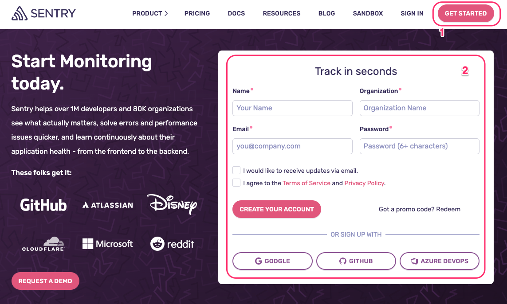
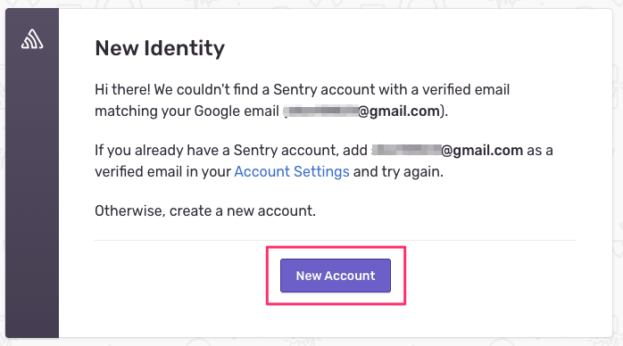
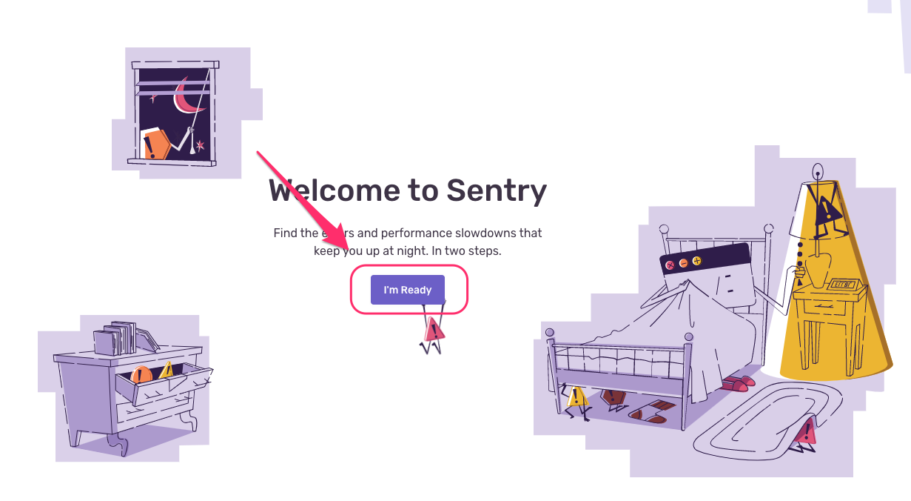
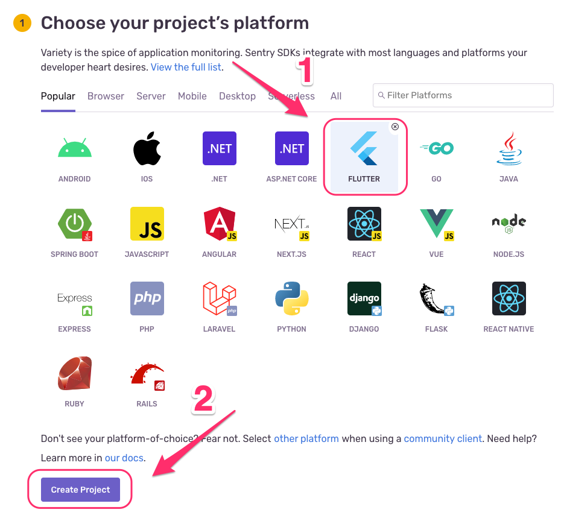
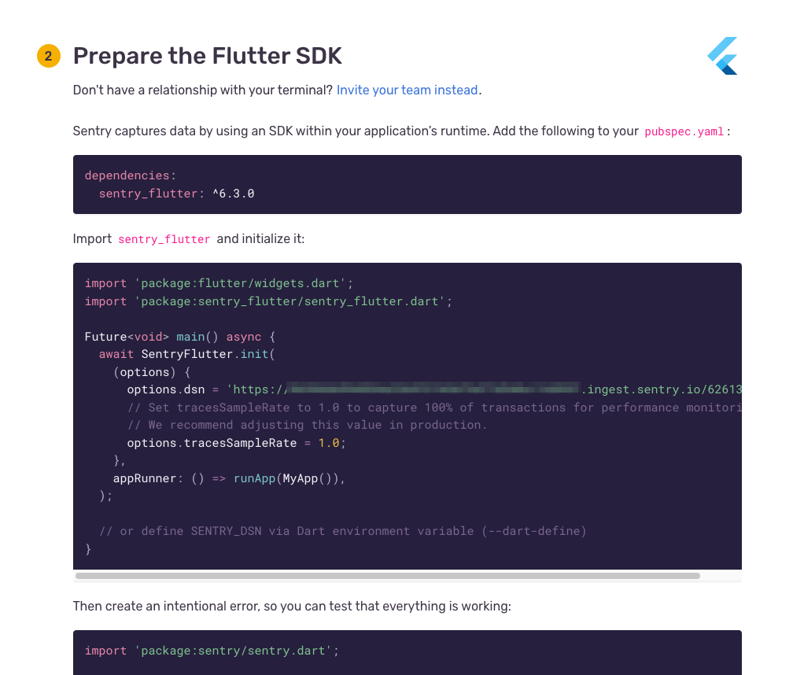
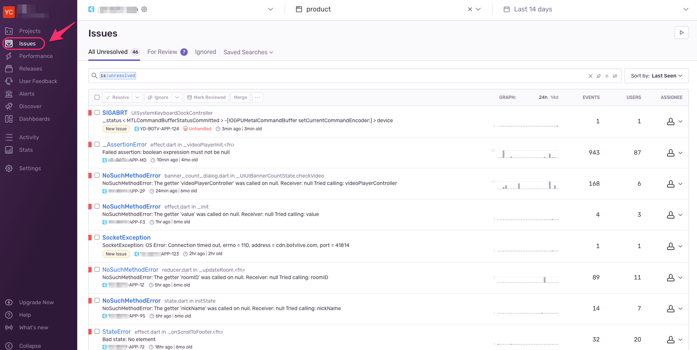
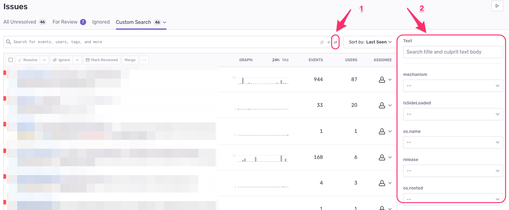

# Sentry 使用指引

- [Sentry 使用指引](#sentry-使用指引)
  - [如何起手式](#如何起手式)
  - [初始化時加入其他版本資訊](#初始化時加入其他版本資訊)
  - [依據條件搜尋 issues](#依據條件搜尋-issues)
  - [參考](#參考)

## 如何起手式

- 以第三方社群帳號或是以自訂的名稱創造帳號

- 若使用第三方社群帳號會詢問是否創建帳號

- 選擇準備好開始

- 選擇您的開發平台並創建專案

- 將提供的設定設置到您的代碼中

- 切換到 issues 即可看到資訊

## 初始化時加入其他版本資訊

## 依據條件搜尋 issues

## 參考

[Sentry](https://sentry.io/)

[Basic Option](https://docs.sentry.io/platforms/flutter/configuration/options/)

---

[=> Top](#sentry-使用指引)

[=> Go Back](../README.md)