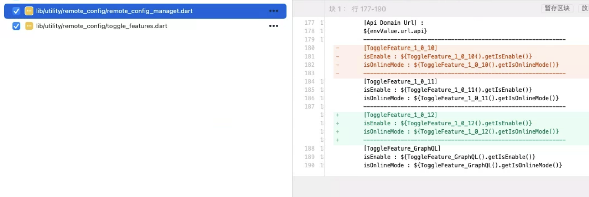

# 線上上版本流程引導


## 概要與引導

當需要將版本推到線上時，所需要的步驟為:

1. 針對iOS/Android雙平台進行打版，並推到平台上

    - [iOS: 下命令打版](#iOS下命令打版)

    - [Android: 直接Gitlib，CICD打版](#Android利用CICD打版)

2. 雙平台的送審設定處理

    - [iOS](#iOS送審步驟)

    - [Android](#Android送審步驟)

3. Firebase設定

    - [強更設定](../Firebase/RemoteConfig/強更設定/README.md) (若需要強更，請直接參考連結內容)

    - [版本相容設定](#不需強更時的版本相容設定) (不需要強更)

4. [線上強更後的版本提升](#強更後的版本提升)

---
---

## iOS下命令打版

1. cd 到專案資料夾下的scm資料夾

    ```
    cd /Users/zayin/clayUse/botv_T2/scm 
    ```

2. 利用工具 ci.sh打版

    - 要帶入版本參數，例如:1.0.10.35

    - 帶入正式環境參數，例如:product.official

    - 因為要出版.xcarchive，因此帶入參數.ipa

    - 以上命令串起來為
        ```
        sh ci.sh 1.0.10.35.product.official.ipa
        ```
    
    - 上面命令執行後會在專案下的scm資料夾多一個[output]，往下找內容可以找到要推送的[official.xcarchive]

    
---

## Android利用CICD打版

遵循CICD出版流程，因此可查閱[Modify Gitlib 出版流程](../GitLabPublishingProcess/README.md)此文章

出版環境請用[正式環境]，參數為product.official

因此出版Tag如下

    [版本號].product.official.apk
---

## iOS送審步驟

- iOS送審可先參考[Xcode Archive Upload To App Store Connect Using Flutter Project](../../../../../../Manual/Mobile/xcode.journey/-/blob/master/Xcode_Archive_Upload_To_AppStoreConnect_Using_FlutterProject/README.md)

- 請先將[iOS下命令打版]中得到xcarchive雙擊後，會自動帶入XCode的[Organizer]視窗


- 後續請依照[參考](../../../../../../Manual/Mobile/xcode.journey/-/blob/master/Xcode_Archive_Upload_To_AppStoreConnect_Using_FlutterProject/README.md) 步驟[11 : Distribute App]操作
---

## Android送審步驟

- Android送審可先參考[Work Before Publish Google Play](../../../../../../Manual/Mobile/Mobile.Info/-/blob/master/Android/workBeforePublishGooglePlay/README.md)

- 請先將[Android利用CICD打版]中得到apk上傳到google play

- 後續請依照[參考](../../../../../../Manual/Mobile/Mobile.Info/-/blob/master/Android/workBeforePublishGooglePlay/README.md)操作
---

## 不需強更時的版本相容設定

1. 開啟Firebase的RemoteConfig，並找到參數[compatibility_versions]


2. 直接新增下個版本的版號

    - EX iOS 原本為[1.0.9,1.0.10]，改為[1.0.9,1.0.10,1.0.11]

    - EX Android 原本為[34,35]，改為[34,35,36]

3. 在RemoteConfig中找到參數[latest_version]

4. 將參數改為新版號

    - EX iOS 原本為 1.0.9，改為1.0.10

    - EX Android 原本為 34，改為35
---

## 強更後的版本提升

當線上更新完畢，也正式上線後，就可以開始調整開發中的版號，需要調整的分為 [code] 與 [firebase] 兩個部分

- code

    - flutter專案中yaml檔的的版號

        


    - remote_config_managet.dart

        

    - toggle_features.dart

        
        
        - class要注意getMode部分，依照需求調整 [onlineMode] or [developMode]
        
        

- firebase

    - RemoteConfig，雙平台ToggleFeature條件新增
    
        

        

    - RemoteConfig 參數[toggle_feature_default],[toggle_feature_product]內相關資料新增

        

        

        

    - 確認 RemoteConfig 的參數[compatibility_versions]是否有相容版號

    - 最後記得 [發布變更]

        
